# AI 对话、流式输出与 SSE 实现分析

> 分析基于 `main` 分支提交 `944d133dc`（2026-07-14）。本文聚焦 AI 对话运行时、流协议、SSE、工具调用、状态归并、React 更新与断线恢复，供后续迁移参考。

## 1. 总体架构

项目将 AI 对话能力拆成三层：

| 层级 | 主要职责 | 代表实现 |
| --- | --- | --- |
| 框架适配层 | 对接 AI SDK、LangGraph、ADK、A2A、AG-UI、OpenCode 等 | `react-ai-sdk`、`react-google-adk` 等 |
| 协议层 | HTTP 请求、流协议编码/解码、SSE、断线恢复 | `react-data-stream`、`assistant-stream`、AssistantTransport |
| 核心运行时 | 消息状态、分支、编辑、重新生成、取消、工具调用、多轮运行 | `LocalRuntime`、`ExternalStoreRuntime` |

仓库文档对这一分层有明确说明：[Runtime architecture](apps/docs/content/docs/runtimes/concepts/architecture.mdx)。

```mermaid
flowchart LR
    UI["Composer / Thread UI"] --> Runtime["LocalRuntime 或 ExternalStoreRuntime"]
    Runtime --> Adapter["AI SDK / DataStream / Provider Adapter"]
    Adapter --> HTTP["POST / SSE / Fetch Stream"]
    HTTP --> Decoder["协议解码器"]
    Decoder --> Chunks["AssistantStreamChunk"]
    Chunks --> Tools["前端工具执行"]
    Tools --> Acc["AssistantMessageAccumulator"]
    Acc --> State["消息快照 / 外部 Store"]
    State --> Subscribe["useSyncExternalStore"]
    Subscribe --> UI
```



## 2. AI 对话运行时

### 2.1 LocalRuntime：运行时管理消息

核心入口为 [`useLocalRuntime.ts`](packages/core/src/react/runtimes/useLocalRuntime.ts)，底层由 [`local-thread-runtime-core.ts`](packages/core/src/runtimes/local/local-thread-runtime-core.ts) 管理。

主要逻辑：

- 用户消息写入 `MessageRepository`。
- 自动创建一条 `status: running` 的 assistant 消息。
- 调用 `ChatModelAdapter.run()`。
- `run()` 可以返回一次性 Promise，也可以返回 `AsyncGenerator`。
- 每次 `yield` 都会更新当前 assistant 消息并通知订阅者。
- 支持取消、重新生成、消息分支、历史加载、工具结果、多轮调用和消息队列。
- 默认 `maxSteps = 2`，达到上限后以 `incomplete/tool-calls` 结束。
- 工具调用完成后，由 `shouldContinue()` 判断是否自动开始下一轮模型调用。
- `AbortController` 贯穿模型请求、响应读取和前端工具执行。

该模式适合“前端运行时拥有消息状态，后端只负责返回模型结果”的架构。

### 2.2 ExternalStoreRuntime：外部系统管理消息

ExternalStore 不主动拥有消息源，而是接收外部状态和回调：

- `messages` 或完整 `messageRepository`
- `isRunning`、`isLoading`
- `onNew`、`onEdit`、`onReload`、`onCancel`
- `onAddToolResult`
- `setMessages`

AI SDK、LangGraph、ADK、A2A、AG-UI、OpenCode 基本都走这条路径。流式状态先由第三方框架维护，再转换成 assistant-ui 的统一消息。

AI SDK 是典型案例：[`useChatRuntime.ts`](packages/react-ai-sdk/src/ui/use-chat/useChatRuntime.ts) 使用 AI SDK `useChat` 管理流，`useAISDKRuntime` 将 `UIMessage[]` 投影为统一消息。

### 2.3 消息仓库与分支

`MessageRepository` 将对话保存为可分支结构，而不是简单数组：

- 每条消息保存父节点、子节点和当前分支的下一节点。
- `head` 表示当前可见分支的末端。
- 编辑、重新生成会创建或切换分支。
- optimistic 消息只用于运行中的 UI 占位，不应持久化。
- 外部 Store 更新服务端消息 ID 时，会清除旧的 optimistic 分支节点。

迁移时如果只保留普通消息数组，会失去编辑、重新生成和分支切换能力。

## 3. 统一流事件模型

底层核心并不是 SSE，而是：

```ts
type AssistantStream = ReadableStream<AssistantStreamChunk>;
```

事件定义在 [`AssistantStreamChunk.ts`](packages/assistant-stream/src/core/AssistantStreamChunk.ts)。

主要事件包括：

- `part-start` / `part-finish`
- `text-delta`
- `tool-call-args-text-finish`
- `result`
- `step-start` / `step-finish`
- `message-finish`
- `data` / `annotations`
- `update-state`
- `error`

内容部件支持：

- text
- reasoning
- tool-call
- source
- file
- data

服务端可以通过 [`AssistantStreamController`](packages/assistant-stream/src/core/modules/assistant-stream.ts) 写入文本、思考过程、文件、来源、工具调用和自定义数据。

这是迁移时最值得保留的设计：先统一内部事件，再单独实现不同网络协议的编码器和解码器。

## 4. 三种主要流协议

| 协议 | 是否真正 SSE | 结束标记 | 主要用途 |
| --- | --- | --- | --- |
| Data Stream v1 | 否 | HTTP 流结束或 finish chunk | 自定义后端、AI SDK v4 兼容 |
| UI Message Stream | 是 | `data: [DONE]` | AI SDK v5+/v7 |
| Assistant Transport | 是 | `data: [DONE]` | 自定义有状态 Agent |

### 4.1 Data Stream v1

编码器位于 [`DataStream.ts`](packages/assistant-stream/src/core/serialization/data-stream/DataStream.ts)。

响应头：

```text
Content-Type: text/plain; charset=utf-8
x-vercel-ai-data-stream: v1
```

帧格式为逐行文本协议，不是 SSE：

```text
0:"文本增量"
g:"思考增量"
b:{"toolCallId":"...","toolName":"..."}
c:{"toolCallId":"...","argsTextDelta":"..."}
a:{"toolCallId":"...","result":...}
d:{"finishReason":"stop","usage":...}
```

客户端解码顺序：

```text
Uint8Array
→ TextDecoderStream
→ LineDecoderStream
→ DataStreamChunkDecoder
→ AssistantStreamChunk
```

[`useDataStreamRuntime.ts`](packages/react-data-stream/src/useDataStreamRuntime.ts) 的请求体包含：

- system
- messages
- tools JSON Schema
- threadId、parentId
- assistantMessageId
- runConfig
- 当前 agent state
- callSettings / config
- 自定义 body

响应处理链路：

```text
DataStreamDecoder / UIMessageStreamDecoder
→ 前端工具执行流
→ AssistantMessageAccumulator
→ async generator yield
→ LocalRuntime 更新消息
```

协议选择优先级：

1. 显式传入 `protocol`。
2. 检查 `x-vercel-ai-data-stream: v1`。
3. 检查 `x-vercel-ai-ui-message-stream: v1`。
4. 无法识别时回退到 `ui-message-stream`。

### 4.2 UI Message Stream SSE

解码器位于 [`UIMessageStream.ts`](packages/assistant-stream/src/core/serialization/ui-message-stream/UIMessageStream.ts)。

格式示例：

```text
data: {"type":"text-delta","delta":"Hello"}

data: {"type":"finish",...}

data: [DONE]
```

实现支持：

- SSE 注释和心跳行。
- 多行 `data:`。
- `\n` 和 `\r\n`。
- text、reasoning、tool、source、file。
- `data-*` 自定义事件。
- transient data：只调用 `onData`，不写入消息。
- 未知事件忽略，便于向前兼容。
- 如果连接结束前没有 `[DONE]`，抛出流异常中断错误。

AI SDK v7 端到端示例：

- 前端：[`examples/with-ai-sdk-v7/app/page.tsx`](examples/with-ai-sdk-v7/app/page.tsx)
- 后端：[`examples/with-ai-sdk-v7/app/api/chat/route.ts`](examples/with-ai-sdk-v7/app/api/chat/route.ts)

这条路径通常由 AI SDK 自己解析 SSE 并维护 `UIMessage[]`。assistant-ui 主要负责消息格式转换和 UI 运行时桥接，不会再次使用 `AssistantMessageAccumulator` 解析同一响应。

### 4.3 Assistant Transport SSE

编码和解码位于 [`AssistantTransport.ts`](packages/assistant-stream/src/core/serialization/assistant-transport/AssistantTransport.ts)。

它直接将标准 `AssistantStreamChunk` 包装成 SSE：

```text
data: {"type":"text-delta","path":[0],"textDelta":"..."}

data: [DONE]
```

`useAssistantTransportRuntime` 的语义不是简单消息流，而是状态流：

- 前端发送 `add-message`、`add-tool-result` 和自定义命令。
- 请求携带当前完整 agent state。
- 后端持续返回 state 更新。
- `AssistantMessageAccumulator` 将 `update-state` 归并为新 state。
- `converter(state, connectionMetadata)` 将 state 转换为 UI 消息。

它采用单飞调度：

- 空闲时立即发送。
- 正在运行时，新命令进入队列。
- 当前运行结束后最多追加一次 follow-up run。
- 多个同步命令通过 microtask 合并。
- 取消会中断当前 fetch 并清理待执行命令。

该入口目前仍从 legacy 目录导出：

- [`packages/react/src/index.ts`](packages/react/src/index.ts)
- [`useAssistantTransportRuntime.ts`](packages/react/src/legacy-runtime/runtime-cores/assistant-transport/useAssistantTransportRuntime.ts)

同时它仍标记为实验性。迁移时不建议直接复制其 React legacy 调度代码，可复用“命令队列 + 状态快照 + converter”的协议思想。

## 5. 流式消息归并

[`AssistantMessageAccumulator`](packages/assistant-stream/src/core/accumulators/assistant-message-accumulator.ts) 是核心状态机。

主要规则：

- `text-delta` 追加到 text 或 reasoning。
- 工具参数增量拼接进 `argsText`，同时解析不完整 JSON，让 UI 提前显示参数。
- 工具参数结束后：`partial-call → call`。
- 收到工具结果后：`call → result`。
- `finishReason: tool-calls`：消息变为 `requires-action`。
- `stop/unknown`：消息完成。
- `length/content-filter/error`：消息不完整。
- error 状态不会被之后到达的 finish chunk 覆盖。
- 流结束但没有 finish 事件时，会自动补最终状态。
- 会计算首 token、持续时间、输出速率和工具耗时。

当前限制：累加器只支持一层 `path`。`parentId` 可以表达关联和分组，但真正的任意深度 chunk tree 暂时不能直接归并。

Data Stream 还存在一个迁移注意点：它不会完整传输所有 `part-finish` 和工具参数结束边界，解码器会根据下一类 chunk 或流结束推断关闭时机。因此不能假设标准事件与网络帧始终一一对应。

## 6. 前端工具调用

Data Stream 路径会在消息累加前插入 `ToolExecutionStream`：

1. 收到 tool-call start，建立 `ToolCallReader`。
2. 增量读取参数 JSON。
3. 参数结束后校验 schema。
4. 调用前端工具 `execute()`。
5. 通过同一条流追加 `result`。
6. 结果进入消息累加器。
7. 如果模型还需要处理工具结果，LocalRuntime 开始下一轮请求。

`ToolCallReader` 还支持从尚未完成的参数中按字段读取或流式读取，适合生成式 UI。

迁移约束：

- `toolCallId` 必须稳定且唯一。
- 工具结果必须关联原始 `toolCallId`。
- 新对话或取消时必须中止仍在执行的前端工具。
- 工具 schema 校验错误需要转为可展示的工具错误结果。
- 后端工具和前端工具必须明确区分，避免重复执行。
- DataStreamRuntime 不支持 `human()` 中断式工具；HITL 应使用 LocalRuntime、AI SDK approval 或更完整的 Agent 协议。

## 7. 提供商专用 SSE

仓库还有几套不经过统一 AssistantStream 的 SSE 实现：

### OpenCode

[`OpenCodeEventSource.ts`](packages/react-opencode/src/OpenCodeEventSource.ts) 使用 SDK SSE async iterable：

- 按订阅者数量建立和关闭连接。
- 断线自动重连。
- 连接失败时采用 1–30 秒指数退避。
- 重连后重新拉取 session、permission 和 question 状态。

### Pi

[`eventSource.ts`](packages/react-pi/src/client/eventSource.ts) 包含纯增量 SSE 解析器：

- 支持 chunk 在任意字符位置断开。
- 支持 CRLF、多行 data、注释心跳。
- 固定延迟重连。
- 采用 snapshot-first 恢复，新连接首先用完整快照替换本地状态，而不是回放旧事件。

服务端示例 [`events/route.ts`](examples/with-pi/app/api/pi/threads/[threadId]/events/route.ts) 每 20 秒发送心跳，并明确区分“客户端断开”和“取消 Agent 运行”。

### A2A

A2A 支持：

- POST `message:stream`
- GET task subscription
- 自定义增量 SSE 分帧
- JSON-RPC 包装解包
- task、message、statusUpdate、artifactUpdate 分类

### Google ADK

[`adkEventStream.ts`](packages/react-google-adk/src/server/adkEventStream.ts) 将 `AsyncGenerator<ADK Event>` 转为 SSE：

- 首先发送注释心跳以穿透代理缓冲。
- 每个事件编码成 `data: JSON`。
- 异常转换为结构化 `STREAM_ERROR` 事件。
- 客户端取消时调用 generator 的 `return()`。

### AG-UI

AG-UI 的 SSE 主要交给 `@ag-ui/client` 的 `HttpAgent`，assistant-ui 负责把 AG-UI 的文本、思考、工具调用和状态快照转换到 ExternalStoreRuntime。

这些实现普遍使用 `fetch + ReadableStream`，而不是浏览器原生 `EventSource`，原因是需要 POST、自定义 header、请求体和 `AbortSignal`。

## 8. React UI 更新链路

运行时每次合并消息后会通知订阅者。React 桥接使用：

- [`useSubscribable.ts`](packages/core/src/store/runtime-clients/useSubscribable.ts)
- [`useAuiState.ts`](packages/store/src/useAuiState.ts)

两者底层均使用 `useSyncExternalStore`。

UI 组件通过 selector 订阅具体字段，例如：

```ts
const isRunning = useAuiState((s) => s.thread.isRunning);
const text = useAuiState((s) => s.part.text);
```

selector 返回值通过 `Object.is` 比较，所以迁移时需要保持不可变更新和稳定引用。若每次 selector 都创建新对象或数组，会导致每个流 chunk 都触发无关组件重渲染。

消息渲染分两层：

- `ThreadPrimitive.Messages` 遍历当前分支中的消息。
- `MessagePrimitive.Parts` 根据 text、reasoning、tool、source、file、data 等类型选择对应组件。

## 9. 断线恢复

`assistant-stream/resumable` 在协议编码之后持久化字节，因此不依赖具体协议。

[`ResumableStreamContext.ts`](packages/assistant-stream/src/resumable/ResumableStreamContext.ts) 的逻辑：

- 同一 `streamId` 的第一个请求成为 producer。
- producer 持续把编码后的字节写入 Store。
- 后续请求成为 consumer，从头回放已存字节，再等待实时字节。
- 支持 `streaming`、`done`、`error`、`missing` 状态。
- 支持内存、Redis、ioredis 或自定义 Store。
- 默认 TTL 为 24 小时。
- 客户端从 `x-resumable-stream-id` 保存流 ID。
- 页面重新加载时调用 resume API。
- 看到 finish 事件后清除本地流 ID。

示例：

- [`examples/with-resumable-stream/app/api/chat/route.ts`](examples/with-resumable-stream/app/api/chat/route.ts)
- [`examples/with-resumable-stream/app/api/chat/resume/[streamId]/route.ts`](examples/with-resumable-stream/app/api/chat/resume/[streamId]/route.ts)
- [`examples/with-resumable-stream/app/page.tsx`](examples/with-resumable-stream/app/page.tsx)

生产迁移要求：

- streamId 必须与用户或租户绑定，不能将 streamId 当作鉴权凭据。
- Serverless 环境必须通过 `waitUntil` 或 `after` 保持 producer 存活。
- 限制单流大小、chunk 数、总流数量和 TTL。
- 恢复接口必须返回与原响应一致的协议 header。
- 恢复时不能再次请求模型，否则会造成重复计费和重复工具执行。

## 10. 推荐迁移路径

### 场景一：使用 Vercel AI SDK

迁移组合：

```text
useChatRuntime
+ AssistantChatTransport
+ UI Message Stream SSE
+ ExternalStoreRuntime
```

优点是工具、多轮调用、approval、附件和消息转换由 AI SDK 适配层完成。

### 场景二：自定义后端，只传消息增量

迁移组合：

```text
AssistantStreamChunk
+ DataStream/UIMessageStream Decoder
+ ToolExecutionStream
+ AssistantMessageAccumulator
+ LocalRuntime
```

适合后端只关心消息生成，不需要暴露复杂 Agent 状态。

### 场景三：已有 Redux、Zustand 或服务端消息状态

采用 ExternalStoreRuntime 模式：

- 外部系统继续拥有消息。
- assistant-ui 只接收消息快照和动作回调。
- 单独编写 provider message → ThreadMessage 转换器。

### 场景四：复杂有状态 Agent

参考 AssistantTransport 的设计：

- 命令上行。
- 状态快照下行。
- converter 将 Agent state 转成 UI state。
- 单飞请求和命令队列控制并发。

不建议直接复制当前 legacy React 实现，应将协议、调度器和 UI 转换层拆开。

### 场景五：需要刷新、断网后续传

在协议编码后的 byte stream 之后增加 resumable store。这样 Data Stream、UI Message SSE、AssistantTransport SSE 都可以复用同一套恢复机制。

## 11. 迁移风险清单

1. 不要把 Data Stream v1 误当作 SSE。
2. 不要只迁移文本 token，必须保留 tool、reasoning、finish、error、usage、data。
3. 不要把网络 chunk 直接存进 UI，应该保留独立的消息累加器。
4. SSE 流结束时必须校验 `[DONE]` 或等价最终状态。
5. 原生 `EventSource` 无法满足 POST、请求体、自定义认证头等场景。
6. 工具参数需要支持 partial JSON，不能等完整 JSON 才渲染。
7. 取消时需要同时中断 fetch、ReadableStream reader、模型运行和工具执行。
8. 断线重连不能重新调用模型。
9. 必须保留稳定的 `messageId`、`toolCallId`、`parentId`。
10. 必须区分“连接断开”和“用户取消运行”。
11. 外部 Store 和 React selector 必须保持不可变更新与引用稳定。
12. 不要同时搬迁 `packages/core/src/react` 与 `packages/react/src/legacy-runtime` 的重复实现；legacy 主要承担兼容职责。
13. Data Stream 的部分边界由解码器推断，不能假设网络事件与内部事件一一对应。
14. 当前 accumulator 不支持任意深度嵌套 path，迁移复杂子消息前需要扩展状态模型。

## 12. 建议保留的最小模块边界

若需要脱离 assistant-ui 迁移到其他项目，建议至少保留以下边界：

```text
Transport
  负责 fetch、headers、abort、reconnect

Wire Decoder
  负责 SSE/逐行协议 → 标准事件

Normalized Event Model
  AssistantStreamChunk 或等价结构

Tool Pipeline
  partial args、schema、execute、result、abort

Message Accumulator
  标准事件 → 不可变消息快照

Conversation Runtime
  消息仓库、分支、run lifecycle、history

UI Store Bridge
  subscribe/getSnapshot/selector

Renderer
  按消息 part 类型渲染
```

这种拆分可以让模型提供商、网络协议、状态管理和 UI 框架独立替换，避免迁移后再次形成强耦合。
