# Workspace 对话逻辑与迁移分析

> 分析范围：当前仓库中的 workspace、会话与对话链路，重点覆盖 CoStrict/CSC、Web UI、VSCode/IDE、设备代理及 iframe 接入。
>
> 证据标记：`[确认]` 表示代码可以直接证明；`[推断]` 表示结合现有架构和迁移上下文得出的判断；`[缺口]` 表示代码显示链路尚未接通、实现不在当前仓库或仍需运行验证。

## 结论摘要

当前仓库已经形成“共享 Chat UI → 设备代理/cs-cloud 协议 → CSC 运行时”的雏形，但存在两套不同含义的 workspace：

1. `packages/app-ai-native` 中面向产品和用户的云端 Workspace，核心是设备、目录和云端设置。
2. `packages/opencode/src/control-plane` 中面向运行时的 Workspace，核心是 project 下的 worktree 或远程执行环境。

当前对话链路的实际隔离主要依赖：

```text
cloudWorkspaceID
  → deviceUniqueId
  → device proxy URL
  → X-Workspace-Directory
  → Session.directory / Instance.directory
  → SessionID
```

虽然运行时 `Session` 已经有可选 `workspaceID`，但该字段没有在现有客户端和公开 Session 列表 API 中形成完整的端到端主链路。因此迁移不能只搬运 `workspace_id`，必须同时保留设备、目录、Project、Session 之间的映射。

推荐把 `SessionChatBackend` 和 `ConversationAdapter` 提升为共享 UI 的稳定边界，把 cs-cloud 固化成版本化 Agent Gateway，把 `packages/opencode` 保持为独立 CSC Runtime。VSCode/JetBrains 只提供 Host Bridge，不复制一套新的对话状态机。

## 1. 现状架构

```mermaid
flowchart LR
  U["用户 / Chat UI"]

  subgraph UI["CoStrict 定制 UI：app-ai-native"]
    W["云端 Workspace<br/>device + directories + settings"]
    S["SessionChatBackend<br/>UI 读模型"]
    A["ConversationAdapter<br/>命令端口"]
    D["DeviceClient<br/>/api/v1/conversations<br/>/api/v1/events"]
  end

  C["云端 Workspace API<br/>/api/workspaces"]
  P["设备代理 URL<br/>/cloud/device/{id}/proxy"]
  G["cs-cloud / Device Gateway<br/>当前仓库只有客户端契约"]

  subgraph CSC["CSC / @costrict/cs 运行时"]
    R["WorkspaceRouterMiddleware<br/>directory / workspace"]
    I["Instance<br/>按目录隔离运行状态"]
    API["/session API + /event SSE"]
    LOOP["SessionPrompt / Processor<br/>LLM + Tool + Permission"]
    E["SyncEvent / Bus"]
    DB["SQLite<br/>Session / Message / Part / Todo"]
    JSON["JSON side storage<br/>diff 等"]
  end

  IDE["VSCode / JetBrains Host<br/>当前未接 Chat WebView"]
  BR["IDE Bridge<br/>postMessage / RPC<br/>迁移新增"]

  U --> W
  W --> C
  W --> S
  S --> A
  A --> D
  D --> P
  P --> G
  G -. "推断：协议转换" .-> R
  R --> I
  I --> API
  API --> LOOP
  LOOP --> E
  E --> DB
  E --> API
  LOOP --> JSON
  API -. "SSE 增量事件" .-> G
  G -.-> D
  D --> S
  IDE -.-> BR
  BR -.-> U
```



### 1.1 两套 Workspace 模型

#### 云端产品 Workspace

`[确认]` `packages/app-ai-native` 中的 Workspace 表示用户看到的产品工作空间，包含云端 workspace ID、设备 ID、设备唯一 ID、目录列表、状态和设置。

- [`Workspace`、`WorkspaceDirectory`](../packages/app-ai-native/src/pages/workspace/types.ts#L27)
- [Workspace API](../packages/app-ai-native/src/pages/workspace/lib/api.ts#L93)
- [设备代理 URL](../packages/app-ai-native/src/pages/workspace/lib/url.ts#L13)
- [`X-Workspace-Directory` 注入](../packages/app-ai-native/src/client/device-transport.ts#L95)

#### CSC 运行时 Workspace

`[确认]` `packages/opencode/src/control-plane` 中的 Workspace 是 project 下的运行环境抽象，字段为 `id/type/branch/name/directory/extra/project_id`。

- [`WorkspaceTable`](../packages/opencode/src/control-plane/workspace.sql.ts#L6)
- [`WorkspaceInfo` 和 `Adaptor`](../packages/opencode/src/control-plane/types.ts#L5)
- [Workspace 创建、删除和同步](../packages/opencode/src/control-plane/workspace.ts#L49)
- [内置 adaptor 注册](../packages/opencode/src/control-plane/adaptors/index.ts#L4)

当前只内置 `worktree` adaptor。其他远程 Workspace 需要动态安装 adaptor，且 `Workspace.startSyncing()` 在仓库中未发现调用点，因此远程同步仍属于实验性能力。

### 1.2 Session 与 Workspace 绑定

`[确认]` `SessionTable` 同时保存 `project_id`、可选 `workspace_id` 和 `directory`：

- [`SessionTable`](../packages/opencode/src/session/session.sql.ts#L14)
- [`Session.Info`](../packages/opencode/src/session/index.ts#L126)
- [`Session.createNext`](../packages/opencode/src/session/index.ts#L381)
- [`Session.fork`](../packages/opencode/src/session/index.ts#L514)

Fork 会继承原 Session 的 `workspaceID`。领域层 `Session.list()` 也支持 `workspaceID` 过滤，但公开的 `GET /session` 目前只接收 `directory`、`archived`、`roots`、`start`、`search` 和 `limit`，没有暴露 `workspaceID`：

- [`Session.list`](../packages/opencode/src/session/index.ts#L747)
- [`GET /session`](../packages/opencode/src/server/routes/session.ts#L34)

`[缺口]` 这说明 `workspaceID` 已进入数据模型，但尚未成为 UI 到运行时的完整主绑定键。

## 2. 关键文件与职责

| 层级 | 文件与关键符号 | 职责 |
|---|---|---|
| UI 产品入口 | [`pages/workspace/components/layout.tsx`](../packages/app-ai-native/src/pages/workspace/components/layout.tsx#L293) | 加载启用的 workspace，生成设备代理 URL，为每个 workspace 挂载 Provider 树 |
| 云 Workspace 模型 | [`pages/workspace/types.ts`](../packages/app-ai-native/src/pages/workspace/types.ts#L27) | `Workspace`、`WorkspaceDirectory` |
| 云 Workspace API | [`pages/workspace/lib/api.ts`](../packages/app-ai-native/src/pages/workspace/lib/api.ts#L93) | workspace/device CRUD、目录管理 |
| HTTP/SSE 客户端 | [`client/device-client.ts`](../packages/app-ai-native/src/client/device-client.ts#L251) | `/api/v1/conversations`、权限、问题、任务和 `/api/v1/events` |
| 目录与错误传输 | [`client/device-transport.ts`](../packages/app-ai-native/src/client/device-transport.ts#L95) | 注入目录、Cookie、鉴权头；标准化 401、429 和代理错误 |
| UI 命令端口 | [`context/device-adapter.ts`](../packages/app-ai-native/src/context/device-adapter.ts#L5) | `ConversationAdapter`：创建、发送、中止、命令、worktree 等 |
| UI 读模型端口 | [`context/session-chat.tsx`](../packages/app-ai-native/src/context/session-chat.tsx#L35) | `SessionChatBackend`：会话、消息、状态、历史、权限、模型 |
| 设备实现适配 | [`context/device-session-chat.tsx`](../packages/app-ai-native/src/context/device-session-chat.tsx#L9) | 将 DeviceWorkspace、DeviceSession、DeviceLocal 组合为通用 Chat 后端 |
| Workspace 状态 | [`context/device-workspace.tsx`](../packages/app-ai-native/src/context/device-workspace.tsx#L162) | 启动恢复、会话列表、状态、权限、SSE 重连、watchdog |
| Session 状态 | [`context/device-session.tsx`](../packages/app-ai-native/src/context/device-session.tsx#L209) | 消息、Part、Todo、Diff、错误缓存及 SSE reducer |
| 发送入口 | [`components/prompt-input/submit.ts`](../packages/app-ai-native/src/components/prompt-input/submit.ts#L75) | 校验、建会话、worktree、乐观消息、异步发送、回滚、中断 |
| 请求 Part 构造 | [`components/prompt-input/build-request-parts.ts`](../packages/app-ai-native/src/components/prompt-input/build-request-parts.ts#L100) | 文本、文件、图片、Agent、workspace 引用转换 |
| 草稿恢复 | [`context/prompt.tsx`](../packages/app-ai-native/src/context/prompt.tsx#L171) | 按目录和 Session 持久化 prompt/context |
| 运行时路由入口 | [`server/router.ts`](../packages/opencode/src/server/router.ts#L30) | 根据 directory/workspace 进入本地 Instance，或转发远程 workspace |
| 运行实例 | [`project/instance.ts`](../packages/opencode/src/project/instance.ts#L66) | 按规范化目录缓存并提供运行时上下文 |
| Session API | [`server/routes/session.ts`](../packages/opencode/src/server/routes/session.ts#L201) | create/list/messages/prompt/prompt_async/abort/fork/revert |
| 对话循环 | [`session/prompt.ts`](../packages/opencode/src/session/prompt.ts#L100) | 每 Session Runner、并发保护、用户消息入库、Agent/Tool 循环 |
| 流处理 | [`session/processor.ts`](../packages/opencode/src/session/processor.ts#L461) | LLM 流、Part delta、工具状态、abort 清理和 retry |
| 重试策略 | [`session/retry.ts`](../packages/opencode/src/session/retry.ts#L10) | 指数退避、Retry-After、错误可重试判定 |
| 消息模型 | [`session/message-v2.ts`](../packages/opencode/src/session/message-v2.ts#L358) | User、Assistant、Part、Tool 状态及事件 |
| 数据表 | [`session/session.sql.ts`](../packages/opencode/src/session/session.sql.ts#L14) | Session、Message、Part、Todo、Permission |
| 事件投影 | [`session/projectors.ts`](../packages/opencode/src/session/projectors.ts#L64) | 将 SyncEvent 原子投影到 SQLite |
| SQLite 初始化 | [`storage/db.ts`](../packages/opencode/src/storage/db.ts#L30) | `opencode.db`、WAL、外键、迁移 |
| VSCode 当前能力 | [`sdks/vscode/src/extension.ts`](../sdks/vscode/src/extension.ts#L8) | 启动/聚焦终端，通过本机 TUI HTTP 接口注入文件引用 |
| iframe 参考实现 | [`pages/multica/multica-page.tsx`](../packages/app-ai-native/src/pages/multica/multica-page.tsx#L104) | origin 校验、路由同步、身份传递和 Session 深链；当前不用于 Chat |

### UI 来源现状

- `[确认]` CSC 包名是 `@costrict/cs`：[`packages/opencode/package.json`](../packages/opencode/package.json#L2)。
- `[确认]` `packages/app` 的 typecheck 明确标记为 upstream reference：[`packages/app/package.json`](../packages/app/package.json#L10)。
- `[缺口]` 桌面端仍导入 `@opencode-ai/app`，而非 `app-ai-native`：[`packages/desktop/src/index.tsx`](../packages/desktop/src/index.tsx#L16)。

因此 `app`、`app-ai-native` 和 desktop 之间还没有完全收敛为单一产品入口，迁移前必须明确哪个包是权威 UI 源。

## 3. 完整对话时序

### 3.1 Workspace 启动与历史恢复

1. UI 获取云端 Workspace 和设备列表。
2. 选择默认目录；虽然模型允许多个目录，但当前每个 Workspace 实例只取 `isDefault` 或第一个目录：[`layout.tsx`](../packages/app-ai-native/src/pages/workspace/components/layout.tsx#L576)。
3. 生成 `/cloud/device/{device}/proxy` 地址。
4. 挂载 `DirectDeviceProviders → WorkspaceInitGate → DeviceWorkspaceProvider`。
5. `bootstrap()` 检查 Agent 可用性，并行读取：
   - 根会话和全部会话；
   - 会话状态；
   - VCS；
   - 权限请求；
   - 问题请求；
   - Agent 和模型。
6. `DeviceSessionStore.loadMessages()` 在首次打开会话时获取消息和 Parts，并按创建时间重排。
7. 建立 `/api/v1/events` SSE。
8. SSE 断开时重新 bootstrap；长时间未收到状态事件时，watchdog 查询权威 status 修正本地状态：[`runWatchdogSweep`](../packages/app-ai-native/src/context/device-workspace.tsx#L704)、[`startEventStream`](../packages/app-ai-native/src/context/device-workspace.tsx#L792)。

### 3.2 消息发送与流式响应

1. `submit.ts` 校验文本、图片、Agent 和模型。
2. 新会话可先创建 worktree，再创建 Session。
3. `buildRequestParts()` 生成文本、文件 URL、图片附件、Agent 和 workspace 元信息。
4. UI 先插入乐观 User Message。
5. 调用 `sessionPromptAsync()`，对应 `/api/v1/conversations/{id}/prompt/async`。
6. `[推断]` cs-cloud 将该协议映射到 CSC 的 `/session/{id}/prompt_async`。当前仓库只找到 `/api/v1/conversations` 客户端调用，没有找到对应服务端路由实现。
7. CSC `SessionPrompt.prompt()`：
   - 检查 Session 是否已有 Runner；
   - 清理 revert 状态；
   - 持久化用户 Message/Part；
   - 将 Session 设为 busy；
   - 选择 Agent、Model 和 Tools；
   - 进入 LLM/工具循环。
8. `SessionProcessor` 处理 LLM 流和工具事件，更新：
   - Assistant Message；
   - text/reasoning delta；
   - tool pending/running/completed/error；
   - step start/finish；
   - token、cost、finish、error。
9. SyncEvent 将稳定状态写入 SQLite；Bus/SSE 推送增量。
10. UI reducer 按 ID 合并乐观消息和权威事件，并增量拼接 Part 文本：[`device-session.tsx`](../packages/app-ai-native/src/context/device-session.tsx#L351)。
11. 完成时收到 `session.status=idle`，UI 解除工作状态并标记非活动会话未读。

同步 `/prompt` 会等待最终消息再返回，异步 `/prompt_async` 立即返回；两者的流式 UI 增量仍来自 SSE，而不是 HTTP 响应分块：[`session routes`](../packages/opencode/src/server/routes/session.ts#L794)。

### 3.3 中断

1. 如果请求还在本地等待 worktree 初始化，UI 只中止本地 `AbortController`。
2. 已进入运行时则调用 `sessionAbort()`。
3. CSC `SessionPrompt.cancel()` 中断对应 Runner。
4. Processor 产生 `AbortError`，停止 LLM 和工具执行。
5. 未结束的工具 Part 被标记为 aborted/error；已经产生的 Assistant 内容仍保留。
6. Session 回到 idle，SSE 更新 UI。

相关入口：

- [UI abort](../packages/app-ai-native/src/components/prompt-input/submit.ts#L75)
- [HTTP session.abort](../packages/opencode/src/server/routes/session.ts#L365)
- [Processor abort 清理](../packages/opencode/src/session/processor.ts#L461)

### 3.4 自动重试

1. Provider 或网络错误进入 `SessionRetry.retryable()`。
2. 默认从 2 秒开始倍增；没有服务端重试头时最多等待 30 秒；支持 `retry-after` 和 `retry-after-ms`。
3. 状态变为 `{ type: "retry", attempt, message, next }`。
4. SSE 将重试状态发送给 UI。
5. 成功后继续同一轮 Assistant Message；失败或中断则结束并记录错误。
6. UI watchdog 对超过宽限期的 retry 状态重新查询 `/status`。

这是同一轮运行内部的自动重试，不等同于用户主动“重新发送上一条消息”。后者应在迁移协议中单独定义。

### 3.5 重载、切换与持久化

- `[确认]` 会话、消息和 Parts 进入 SQLite，数据库位于 CoStrict 数据目录下的 `opencode.db`，启用 WAL 和外键。
- `[确认]` diff 等少量旁路数据仍使用 JSON Storage。
- `[确认]` Prompt 草稿按目录和 Session 持久化。
- `[确认]` 模型和 Agent 选择保存在 localStorage。
- `[确认]` 已启用的 Workspace 组件会一直挂载，只改变显示状态，因此 SPA 生命周期内切换 Workspace 能保留内存状态。
- `[缺口]` `activeSessionID` 和内容 tabs 只在内存中，刷新页面后不会恢复：[`device-local.tsx`](../packages/app-ai-native/src/context/device-local.tsx#L105)、[`content-tabs.ts`](../packages/app-ai-native/src/context/content-tabs.ts#L23)。

## 4. 迁移时必须保留的功能

### P0：核心行为

- Workspace、设备、目录、Project、Session 五类身份及映射。
- 每目录独立的运行实例、配置、模型、权限、工具和文件系统上下文。
- Session 创建、更新、删除、fork、revert/unrevert 和父子会话。
- User/Assistant/Part 的稳定 ID 和事件幂等合并。
- 文本、reasoning、文件、图片、Agent、subtask、tool、step 等 Part 类型。
- 乐观发送，以及失败后的消息回滚和输入恢复。
- 异步提交和 SSE 增量响应。
- busy/retry/idle 状态机。
- 用户中断、Agent 重启、SSE 断线后的状态校正。
- Provider 自动重试及重试倒计时。
- Tool pending/running/completed/error 和中断清理。
- Permission、Question、自动接受策略及安全边界。
- 消息历史、Todo、Diff、任务和子 Agent 状态。
- SQLite 持久化、迁移、级联删除和并发写保护。
- 会话目录、worktree 和文件引用路径解析。
- 多 Workspace 同时运行，切换后流不中断。
- 401、429、设备离线、代理错误、运行时不可用和模型错误的区分展示。

### P1：产品体验

- Prompt 草稿和上下文恢复。
- 模型、Agent 的逐 Session 选择。
- 未读会话和后台完成通知。
- VCS 分支和状态实时更新。
- 会话标题重命名、搜索、归档和分页。
- Workspace 设置云端同步。
- 从外部页面按 Session ID 探测设备并深链打开。

## 5. 可拆分的迁移边界

| 边界 | 当前基础 | 推荐迁移方式 |
|---|---|---|
| Chat 展示层 | Timeline、Composer、工具卡片 | 保持纯 Web UI，不直接依赖 VSCode/JCEF API |
| UI 读模型 | `SessionChatBackend` | 作为 Web、VSCode、JetBrains 的统一状态接口 |
| UI 命令端口 | `ConversationAdapter` | 补全稳定类型，禁止组件直接调用 DeviceClient |
| cs-cloud 协议 | `/api/v1/conversations`、`/events` | 固化为版本化 Agent Gateway 协议 |
| CSC Runtime | `/session`、SessionPrompt、Processor | 保持独立，可被 CLI、云端和 IDE 共用 |
| IDE Host Bridge | 当前缺失 | VSCode WebView/JCEF 只负责 IDE 原生能力和认证注入 |
| 持久化 | SQLite、JSON、浏览器 storage | 区分服务端权威状态和纯 UI 偏好 |

### 推荐迁移顺序

1. 将 `ConversationAdapter` 和 `SessionChatBackend` 定义成明确、无 `any` 的稳定契约。
2. 为 `/api/v1/conversations` 和 SSE 事件建立版本号、事件序号和恢复游标。
3. 单独测试 cs-cloud 的协议转换层，不让 UI 知道 CSC 的 `/session` 路由细节。
4. 浏览器、VSCode WebView、JetBrains JCEF 共用同一 Chat bundle。
5. IDE 功能通过 Host Bridge 暴露，例如：

   ```text
   ide.ready
   ide.capabilities
   editor.getSelection
   editor.openFile
   editor.revealRange
   terminal.run
   workspace.getRoots
   auth.getToken
   ```

6. 每条 `postMessage` 包含 `version/requestId/type/payload`，严格校验 origin、消息 schema 和 capability。

`[推断]` iframe 可以承载共享 Chat UI，但不能同时承担设备代理、IDE API 和 CSC 协议三种职责。仓库中的 Multica 页面可以复用 origin 校验、ready handshake、路由同步和深链思路，但不能照搬其中对部分路由消息使用 `"*"` 作为目标 origin 的做法：[`multica-page.tsx`](../packages/app-ai-native/src/pages/multica/multica-page.tsx#L167)。

## 6. 风险与验证用例

### 6.1 主要风险

| 等级 | 风险 | 事实依据或影响 |
|---|---|---|
| 高 | 两套 Workspace ID 产生错绑、串目录或删除不同步 | 云 Workspace 与运行时 Workspace 是不同模型和 API |
| 高 | cs-cloud 服务端协议转换实现不在当前仓库 | 全仓 `/api/v1/conversations` 只命中客户端定义 |
| 高 | SSE 重连期间可能丢事件 | 自定义 SSE parser 没有事件 ID/`Last-Event-ID`，主要依赖重新 bootstrap 和 watchdog |
| 高 | 历史分页实际上不可连续加载 | `historyLoadMore` 注释明确说明已有缓存后基本 no-op：[`device-session.tsx`](../packages/app-ai-native/src/context/device-session.tsx#L577) |
| 高 | worktree 新会话可能仍使用原目录客户端 | `submit.ts` 创建新 `client`，但随后继续使用原 `deviceAdapter`；属于高可信疑似缺陷，需运行验证：[`submit.ts`](../packages/app-ai-native/src/components/prompt-input/submit.ts#L198) |
| 中 | 多目录 Workspace 只实际挂载默认或首目录 | `layout.tsx` 当前只选择一个目录 |
| 中 | `workspaceID` 领域过滤未暴露到 Session HTTP list | API 只向 `Session.list()` 传 directory |
| 中 | 远程 Workspace 能力仍是实验性 | 内置 adaptor 只有 worktree，`startSyncing()` 未发现调用点 |
| 中 | 页面刷新后丢失当前会话和 tabs | 两者是内存 signal/store |
| 中 | 三套 UI 来源持续漂移 | `app`、`app-ai-native`、desktop 引用关系未统一 |
| 中 | iframe 下认证、CORS、CSP 需要重新设计 | DeviceClient 使用 Cookie 和鉴权头；CSC CORS 只允许受控来源：[`server.ts`](../packages/opencode/src/server/server.ts#L70) |
| 中 | Windows、WSL、远程设备的路径语义不同 | 文件 Part 在浏览器侧拼接绝对路径和 `file://` URL |
| 安全 | 自动接受权限扩大 IDE/云端执行权限 | Workspace 设置可以自动回复 permission `once` |
| 安全 | iframe 消息伪造或身份泄漏 | 必须校验 origin、schema、capability 和目标 Workspace/Session |

### 6.2 必测用例

1. 同设备、不同目录创建会话，消息、文件、VCS 和权限不得串 Workspace。
2. 两设备存在同名路径时，必须按 device ID 正确路由。
3. Session 创建后刷新页面，历史、Parts、Todo、Diff 和状态能够恢复。
4. 页面刷新前处于 busy/retry，恢复后最终状态与运行时一致。
5. SSE 在 text delta、tool running、permission asked 三个阶段分别断网，重连后无重复、无缺失、无永久 busy。
6. 发送成功但 SSE 延迟时，乐观消息只能出现一次。
7. `prompt_async` 返回成功后运行时立即失败，UI 必须显示 `session.error`。
8. 发送 HTTP 失败时，乐观消息删除，原输入和附件恢复。
9. 在生成文本、执行工具、等待权限和 retry 倒计时四个阶段分别中断。
10. 对 429、Retry-After、连接重置和上下文溢出分别验证可重试/不可重试策略。
11. 加载超过 50、100、500 条消息的会话，验证真正的游标分页和顺序。
12. worktree 新会话的 create、prompt、messages 和 events 必须全部使用 worktree 目录。
13. Workspace 删除、设备离线、Agent 重启时，挂起请求和 SSE 正确释放。
14. Fork 必须继承 Workspace/目录，并只复制指定消息之前的历史。
15. SQLite 进程异常退出后重启，验证 WAL 恢复，消息与 Part 不产生孤儿数据。
16. 分别验证 VSCode 多根工作区、未保存文件、行选择、WSL 路径和 Remote SSH 路径。
17. iframe 使用错误 origin、错误 Workspace、过期 token 或重复 requestId 时必须拒绝。
18. 同一 Chat bundle 在浏览器、VSCode WebView 和 JetBrains JCEF 下运行相同协议契约测试。
19. 自动接受权限开启/关闭切换时，新旧权限请求行为必须符合安全策略。
20. 从外部 Session 深链进入时，应探测到正确设备、目录和 Workspace；找不到时不得创建错误绑定。

## 最终迁移建议

1. 把 `app-ai-native` 中的 `SessionChatBackend + ConversationAdapter` 定为共享 Chat UI 的正式端口。
2. 把 cs-cloud 定义成带版本、事件游标、能力协商和错误规范的 Agent Runtime Gateway。
3. 保持 CSC SessionPrompt、Processor、Tool、Permission 和 SQLite 状态机独立，不把运行逻辑搬进 UI 或 IDE 插件。
4. VSCode/JetBrains 只实现 Host Bridge 和宿主能力，Web UI 不直接引用 IDE API。
5. 先统一 Workspace 身份模型和目录路由，再迁移 UI；否则最容易出现跨目录会话、错误文件上下文和历史恢复问题。

## 分析边界

本文基于当前仓库的静态代码检索。云端 `/api/workspaces`、设备代理和 `/api/v1/conversations` 的服务端实现不在当前仓库，因此其到 CSC `/session` 的映射被标为推断。涉及 SSE 丢包恢复、worktree 目录选择、iframe 认证和真实多设备路由的结论，应通过上述端到端用例进一步确认。
