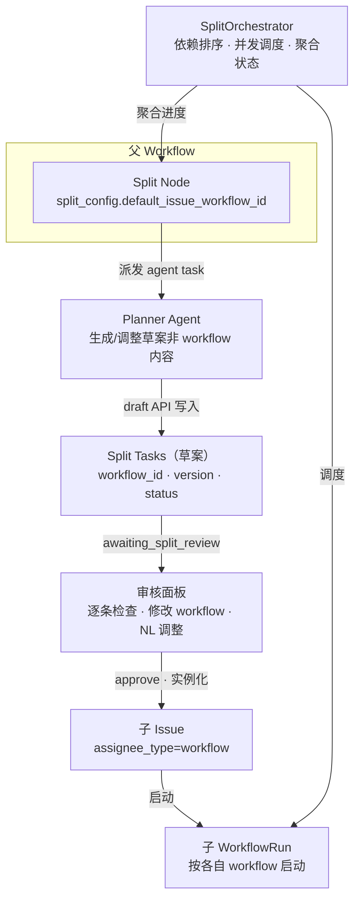
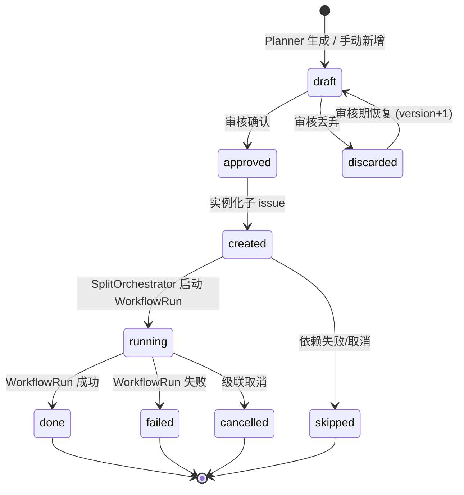
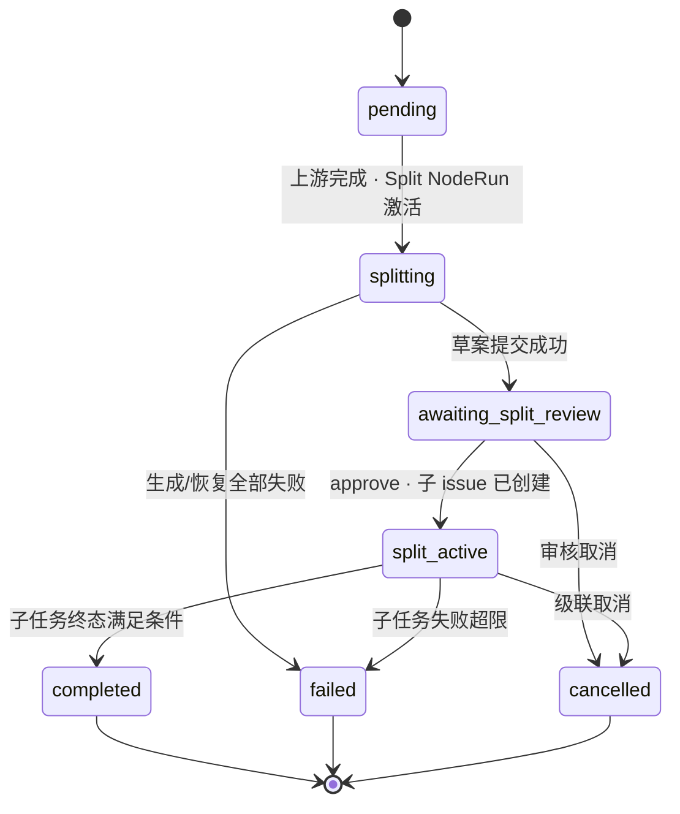
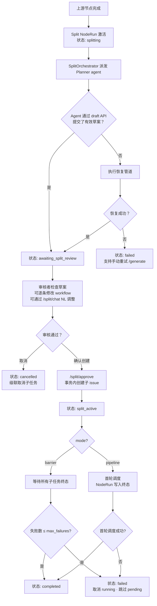
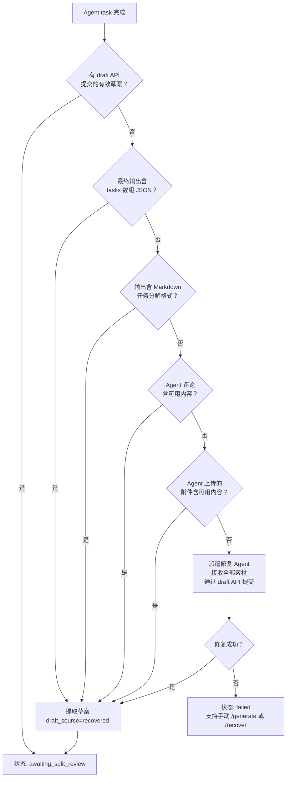

# 动态任务拆分设计

## 概述

为 workflow 新增"任务拆分节点"（Split Node）：由 Planner agent 根据上下文动态生成子 issue 草案，经人工审核后批量创建子 issue，每个子 issue 按各自的 workflow 独立执行；父 workflow 聚合展示所有子 issue 的实时进展。

核心原则：

- **Worker = 草案生成者，Critic = 草案审核者**。沿用现有 Worker/Critic 模型。
- **Workflow 绑定在每条草案上**，不在 split 节点上。split 节点只提供默认 issue workflow。
- **人工审核是安全闸门**。草案必须经人工确认后才创建子 issue。
- **Success-first 策略**：不依赖 Agent 的单一输出格式，最大化到达 `awaiting_split_review` 的概率。Agent 可通过专用 draft API 主动提交结构化草案；若 Agent 未使用 draft API，后端依次从最终输出 JSON、Markdown 分解、评论、附件中恢复草案；全部失败时派遣修复 Agent 兜底。无论草案来自结构化提交还是自动恢复，都须经人工审核。详见[恢复管道](#恢复管道)。
- **拆分阶段严格控制副作用**。Agent 不能修改 issue 状态或直接创建子 issue。
- **默认 Worker 使用内置拆分专用 Agent**，按模板类型自动选择（coding → split-planner-code, design → split-planner-design, test → split-planner-test, fallback → split-planner-general）。用户可覆盖，但非专用 agent 触发预检警告。

## 核心概念

| 术语 | 含义 |
|------|------|
| Planner agent | split 节点自己的 agent，负责生成和调整子 issue 草案的非 workflow 内容 |
| 默认 issue workflow | split 节点配置的默认 workflow，后端用于填充动态生成的草案 |
| 草案 workflow | 每条 split task 上的 `workflow_id`，审核面板可修改 |
| 子 issue workflow | 子 issue 创建后绑定并启动的 workflow |
| split group | 一个 split node run 下的全部草案、子 issue、WorkflowRun 和聚合状态 |

第一期只支持 workflow 作为子 issue 的执行方式。



## 数据模型

### workflow_node.format_schema

```json
{
  "type": "split",
  "split_config": {
    "default_issue_workflow_id": "<workflow_uuid>",
    "mode": "barrier",
    "max_concurrency": 5,
    "max_failures": 0
  }
}
```

规则：

- `default_issue_workflow_id` 必填，必须指向同 workspace 下 active workflow
- 不能指向当前 workflow，指向的 workflow 不能包含 split 节点
- 第一期不支持运行期修改 `mode`

### multica_workflow_split_task

```sql
CREATE TABLE multica_workflow_split_task (
  id            UUID PRIMARY KEY DEFAULT gen_random_uuid(),
  node_run_id   UUID NOT NULL REFERENCES multica_workflow_node_run(id) ON DELETE CASCADE,
  workspace_id  UUID NOT NULL REFERENCES multica_workspace(id) ON DELETE CASCADE,
  draft_key     TEXT,
  title         TEXT NOT NULL,
  description   TEXT NOT NULL DEFAULT '',
  depends_on    JSONB NOT NULL DEFAULT '[]',
  sort_order    INT NOT NULL DEFAULT 0,
  draft_source  TEXT NOT NULL DEFAULT 'agent' CHECK (draft_source IN ('agent', 'chat', 'recovered')),
  workflow_id   UUID NOT NULL REFERENCES multica_workflow(id),
  version       BIGINT NOT NULL DEFAULT 1,
  status        TEXT NOT NULL DEFAULT 'draft' CHECK (status IN (
    'draft', 'approved', 'discarded', 'created', 'running', 'done', 'failed', 'cancelled', 'skipped'
  )),
  issue_id      UUID REFERENCES multica_issue(id) ON DELETE SET NULL,
  run_id        UUID REFERENCES multica_workflow_run(id) ON DELETE SET NULL,
  dispatch_key  TEXT,
  last_error    JSONB,
  created_at    TIMESTAMPTZ NOT NULL DEFAULT now(),
  updated_at    TIMESTAMPTZ NOT NULL DEFAULT now()
);

CREATE UNIQUE INDEX idx_workflow_split_task_node_run_draft_key
  ON multica_workflow_split_task(node_run_id, draft_key)
  WHERE draft_key IS NOT NULL AND draft_key <> '' AND status <> 'discarded';
```

- `draft_key` 是 Agent upsert 草案的稳定业务键，同 node_run 下的非 discarded 草案中唯一
- `draft_source` 标注草案来源：`agent`（Planner 生成）、`chat`（审核对话调整或手动新增）、`recovered`（恢复管道）
- `workflow_id` 是每条草案的执行 workflow，后端在 INSERT 前填充默认值
- `version` 用于审核期并发控制
- `dispatch_key TEXT`：split task 每次派发尝试的幂等键；格式为 `split-task:<task-id>:attempt:<version>`。
- `last_error JSONB`：保存结构化的子 workflow 启动失败信息。
- `multica_workflow_run.dispatch_key TEXT`：确保同一 split task attempt 最多创建一个 child run。
- `(node_run_id, draft_key)` 唯一索引仅覆盖 `status <> 'discarded'`，因此 discarded key 可被后续新草案复用。

**状态流转**：



**NodeRun 状态流转**：



### 子 issue 创建规则

```
assignee_type = "workflow"
assignee_id   = split_task.workflow_id
workflow_id   = split_task.workflow_id
origin_type   = "workflow_split"
origin_id     = split_task.id
```

子 issue 的启动、取消、重试只由 SplitOrchestrator 处理，普通 issue 链路不得自动启动 workflow_split 子 issue。

数据约束：
- `multica_issue.origin_type` CHECK 约束须包含 `workflow_split`
- `origin_type = "workflow_split"` 的一级子 issue 使用 `origin_id = split_task.id`
- 子 workflow 内部节点对应的 sub-issue 继续使用 `origin_type = "workflow"`、`origin_id = workflow_node_run.id`
- issue 列表默认隐藏 workflow 派生 issue 时，需同时排除 `workflow` 和 `workflow_split` 两种 origin_type
- workflow_split 子 issue 活跃期间，禁止将 `assignee_type` 改为非 `workflow`

### multica_workflow_node_run 新增

NodeRun 状态流转详见数据模型章节的 [NodeRun 状态流转图](#数据模型)。

新增列：
- `split_review_chat_session_id UUID` — 每个 split node run 最多绑定一个审核 chat session。
- `split_config_version BIGINT NOT NULL DEFAULT 1` — split 配置并发控制版本号，随 `PATCH /split/config` 递增。PATCH 请求必须携带 `expected_config_version`，冲突返回 `409 split_config_conflict`。

## 生命周期



### 整体流程

详见上方生命周期流程图。关键阶段说明见下文各小节。

### Planner agent 草案生成

Planner agent 只生成草案内容（标题、描述、依赖），不生成 `workflow_id`。后端接收后统一填充 `default_issue_workflow_id`。若 Agent 传入 `workflow_id`，后端直接忽略。

结构化上下文注入：

- `workflow_node_run_id`、`parent_issue_id`、`parent_issue_title`、`parent_issue_description`
- `split_config`（含 `default_issue_workflow_id`）
- `planner_agent` 信息
- `issue_workflow_summary`
- `draft_cli_examples`

Prompt 规则：
- 不调用 `agent list` 选择执行者
- 不把 issue ID 当 node run ID
- 不发表评论、不修改 issue 状态
- `draft submit` 成功后停止

### 拆分阶段副作用控制

仅靠 prompt 指令不足以防止 Agent 在拆分阶段执行破坏性操作。平台基于 `X-Task-ID` 识别拆分阶段请求并控制副作用，覆盖 `split_generate`、`split_repair` 和 `split_chat` 三个 phase 的 agent task：

| 操作类型 | 策略 |
|---------|------|
| 只读查询（issue、comment、member、agent、workspace） | 允许 |
| Draft API 调用（draft-tasks、draft-submit） | 允许 |
| Issue 状态变更 | 禁止 |
| Issue 创建 / 更新 / 分配 | 禁止 |
| 评论和附件上传 | 允许（仅作为恢复素材，不作为权威输出） |

`split_chat` agent 额外约束：通过 draft API 写回草案时，只能修改白名单字段（title、description、depends_on、sort_order、discarded），不得修改 `workflow_id`、`draft_key`、`status`、`version`。

误操作产生的评论和附件不视为任务完成，不直接消费为子 issue，仅作为恢复管道输入素材。

### 审核期

审核面板逐条展示草案，支持以下操作。**workflow 修改只能走确定性 API**（逐条/批量 PATCH），**自然语言只能调整非 workflow 字段**（title、description、depends_on）：

- 行内下拉精确修改单条草案的执行 workflow（确定性 PATCH API）
- 确定性批量 workflow 修改（批量 PATCH API）
- 确定性新增、丢弃、恢复草案
- `/split/chat` 自然语言调整标题、描述、依赖（不含 workflow）
- 空草案需显式确认 `confirm_empty: true`

约束：
- 任一保留草案缺少有效 workflow 时，确认创建按钮禁用
- 所有修改必须携带 `expected_version`，版本冲突返回 `409 draft_task_conflict`
- workflow 校验失败返回 `422 invalid_split_task_workflow`
- approved task 的 `depends_on` 引用 discarded task 时，approve 返回 `422 invalid_split_task_dependency`，系统不自动解除依赖
- 审核面板长时间打开后，保存和确认创建均以后端实时校验为准

**审核超时和引用失效**：

- 第一阶段不自动删除长期未审核的草案，所有引用在 PATCH 和 approve 时实时校验
- 默认 issue workflow 或草案 workflow 失效时，approve 返回 `422 invalid_split_task_workflow`，前端刷新选项并提示
- 父 workflow 已被修改时，已有 node run 继续按创建时的 split config 快照执行
- workspace 或父 issue 不可用时，请求返回 `404` 或 `409`，审核面板进入只读错误状态

**空草案完成**：Planner agent 可生成 0 个草案，审核面板展示空态。确认需显式传 `confirm_empty: true`。完成后 split node 直接完成不创建子 issue。已完成空草案不自动重新生成；父 issue reopen 不支持把已完成 split node 回退到审核态。

### 实例化与调度

Approve 在一个 DB 事务中：
- 创建所有 approved 子 issue
- 回写 `issue_id`，标记 discarded
- 初始化 split group 调度状态

SplitOrchestrator 调度：
- 按拓扑顺序 + `max_concurrency` 启动子 WorkflowRun
- 使用 dispatch key `split-task:<task-id>:attempt:<version>` 保证幂等
- 启动后回写 `issue.workflow_run_id` 和 `split_task.run_id`

**并发安全**：

- `ApproveSplit` 使用 `SELECT ... FOR UPDATE` 锁定 `multica_workflow_node_run` 行
- `ScheduleReadyTasks` 使用同一把行锁串行处理同一 split node_run
- 子 WorkflowRun 状态回调只记录事实并触发调度；最终决策以 DB 当前状态为准，不依赖 WS 去重

### barrier 模式

同步屏障：父 split node 等所有非 discarded 子任务终态后才释放下游。

- 所有子任务终态后，失败数 ≤ `max_failures` → completed
- `failed + user_cancelled > max_failures` → 失败清理：取消 running、跳过 pending、保留 done、父节点 failed
- `skipped` 不额外计入失败数（它是依赖失败/取消的派生结果，避免同一根因重复计数）
- 已完成子 workflow 的副作用不回滚

### pipeline 模式

异步释放：子 issue 创建且首轮调度成功后，将父 split node 写入 `completed` 终态并立即释放下游，子任务后台继续。pipeline 释放只以 node run 终态为准；split task 聚合状态独立计算，不使用 `split_initial_dispatch_completed` 标记。

**首轮调度**：按依赖和拓扑顺序寻找当前 ready task，在 `max_concurrency` 允许范围内尽可能启动；无 ready task 或并发满时结束。

- 首轮调度成功后父节点 completed，子任务由 SplitOrchestrator 后台调度；父 node run 终态与 split task 聚合状态分离持久化
- **若存在 ready task 但首个 WorkflowRun 启动失败**，父 split node → `failed`，不释放下游
- **若 DAG 合法但没有任何无依赖 ready task**，说明依赖图校验有缺口，返回 `422 invalid_split_task_dependency`，不释放下游

**SplitOrchestrator 重启恢复**：

- 父 node run 已为终态 → 只恢复 split task 后台调度和聚合，不重复释放 pipeline
- 父 node run 仍为 `split_active` → 重新执行首轮调度，成功后以 node run 终态释放 pipeline

**父节点释放后**：

- 后续子任务失败不回滚父节点（不会从 `completed` 改回 `failed`），通过聚合状态、事件流和通知暴露
- 父 workflow 完成事件必须附带 split group 摘要；若仍有子任务未终态，显示"父流程已完成，拆分任务仍在执行"
- `max_failures` 仍约束 pipeline split group，超限时停止启动新任务、取消 running、跳过 pending

**并发计数规则**：

- `max_concurrency` 只统计 `status = running` 的 split task（已启动但未终态）
- `created` 不占并发槽位；`done`/`failed`/`cancelled`/`skipped` 不占并发槽位

### 聚合错误模型

子 WorkflowRun 或 NodeRun 失败时，聚合层保留失败定位路径，便于父 issue 和画布展示"哪个子任务、哪个节点、什么错误"。split task response 包含可选 `last_error`：

| 字段 | 含义 |
|------|------|
| `code` | 错误码 |
| `message` | 错误描述 |
| `child_issue_id` | 子 issue ID |
| `workflow_run_id` | 子 WorkflowRun ID |
| `node_run_id` | 失败节点 ID |
| `occurred_at` | 发生时间 |

pipeline 已释放后发生的失败同样写入 split group 聚合状态和事件流，不回写父 split node 终态。

### 取消与重试

父 issue 取消 → 级联取消 split group：
- 取消 running task 的 WorkflowRun
- created/pending task → cancelled/skipped
- 未实例化草案 → discarded
- 已创建子 issue → cancelled
- 父节点 → cancelled
- 前端必须展示二次确认，说明受影响子任务数量

父 issue 在 split group 活跃期间不允许硬删除。删除请求须先转为取消流程；取消完成后再执行已有软删除或归档语义。

重试单个子任务（仅 `failed` 且有 `issue_id`）：
- 清空旧 `run_id`，按当前 `workflow_id` 重新启动
- 可选传入新 `workflow_id`，实时校验

## API 设计

### Planner 草案 API

```
POST /api/node-runs/{nodeRunID}/split/draft-tasks/batch
```

批量原子写入，使用 `(node_run_id, draft_key)` 幂等 upsert。Agent 传入的 `workflow_id` 被忽略，后端用默认值填充。整批在一个事务内完成，任一校验失败整批回滚。

### 读取草案

```
GET /api/node-runs/{nodeRunID}/split/tasks
```

返回当前 split node run 下所有草案及聚合进度。响应包含 `tasks` 数组和 `progress` 对象（total/created/running/done/failed/cancelled/skipped）。

### Draft API 安全契约：draft API 仅允许当前 split 相关 agent task 调用：

- 请求必须携带 `X-Task-ID` 和 `X-Agent-ID` header
- `X-Task-ID` 必须指向当前 `node_run_id` 绑定的 active split task，且 task context `phase` 为 `split_generate`、`split_repair` 或 `split_chat`
- `X-Agent-ID` 必须等于该 task 的 `agent_id`
- `split_generate` / `split_repair` 只允许在 `splitting` 状态写草案
- `split_chat` 只允许在 `awaiting_split_review` 状态写草案
- upsert 必须使用非空 `draft_key`，后端按 `(node_run_id, draft_key)` 幂等更新
- delete 只能标记 `discarded`，不能物理删除

### 审核期确定性修改

```
PATCH  /api/node-runs/{nodeRunID}/split/draft-tasks/{taskID}
PATCH  /api/node-runs/{nodeRunID}/split/draft-tasks/batch
POST   /api/node-runs/{nodeRunID}/split/draft-tasks          (手动新增)
PATCH  /api/node-runs/{nodeRunID}/split/config               (修改并发参数)
```

所有修改必须携带 `expected_version`，版本冲突返回 `409 draft_task_conflict`。workflow 校验失败返回 `422 invalid_split_task_workflow`。成功返回完整 split tasks response。

```
DELETE /api/node-runs/{nodeRunID}/split/draft-tasks/{taskID}
POST   /api/node-runs/{nodeRunID}/split/draft-submit
POST   /api/node-runs/{nodeRunID}/split/reset-original
```

`draft-submit`、`reset-original` 和 draft delete 是恢复与审核流程的正式操作端点。

**Config PATCH 规则**：

- `awaiting_split_review` 和 `split_active` 状态可修改 `max_concurrency`（第一期不可修改 `mode`）
- 必须携带 `expected_config_version`，冲突返回 `409 split_config_conflict`，成功后 `config_version += 1`
- 运行期调大后 SplitOrchestrator 尽量启动更多 ready task；调小后不取消已 running task，仅等 running 数低于新上限后才继续启动

### /split/chat

```
POST /api/node-runs/{nodeRunID}/split/chat
```

用户发 NL 指令，Agent 调整草案。只能修改白名单字段（title、description、depends_on、sort_order、discarded），不得修改 `workflow_id`。复用现有 chat session 体系持久化对话历史。同一 split node run 同时只允许一个 active split chat task，避免并发覆盖草案。

建议覆盖的自然语言操作：

- 添加：`添加一个安全审计子 issue`
- 删除：`删除第 3 个子 issue`
- 修改：`把第 1 个标题改成 "迁移核心数据库"`
- 合并：`合并第 2 个和第 3 个`
- 拆分：`把支付模块拆成前端和后端两个子 issue`
- 依赖：`第 4 个依赖第 2 个和第 3 个完成后再开始`
- 恢复：`恢复到最初生成的草案`

### /split/approve

```json
{
  "approved_task_ids": ["uuid-1", "uuid-3"]
}
```

空草案须显式确认：

```json
{
  "approved_task_ids": [],
  "confirm_empty": true
}
```

不再接受 `modifications`。approve 前校验 title、workflow、依赖 DAG、discarded 交叉引用。在一个事务内完成所有子 issue 创建。幂等：使用 `split_task.id` 防止重复创建。单次 approve 的非 discarded task 上限为 50，超过返回 `422 split_task_limit_exceeded`。

### /split/cancel

```
POST /api/node-runs/{nodeRunID}/split/cancel
```

取消 split 节点并级联停止所有子任务：取消 running WorkflowRun，标记 created/pending task 为 cancelled/skipped，已创建子 issue 标记 cancelled，父 node_run → cancelled。前端须先经二次确认。

### 可选 Workflow 列表

```
GET /api/workflows/{id}/split/issue-workflow-options
```

其中 `{id}` 即 parent workflow id；不提供并行兼容路由。返回同 workspace 下 active、非当前 workflow、不含 split 节点的 workflow。

### 重试 API

```
POST /api/node-runs/{nodeRunID}/split/tasks/{taskID}/retry
```

可选传入新 `workflow_id`，实时校验后重新启动 WorkflowRun。

### 重新生成

```
POST /api/node-runs/{nodeRunID}/split/generate
```

Agent 生成拆分方案失败后，手动触发重新生成。后端重新派发 Planner agent task，注入当前上下文。

### 手动恢复

```
POST /api/node-runs/{nodeRunID}/split/recover
```

从已有 Agent 输出、评论、附件中手动触发恢复管道，尝试提取草案。

## 恢复管道

Agent task 完成后，按优先级恢复草案：



恢复的草案标注 `draft_source = "recovered"`，审核面板展示提醒。

## 可观测性

Split 生命周期关键事件用于监控、排障和聚合状态推导。每个事件携带 `workflow_node_run_id`、`workflow_run_id`、`agent_task_id`（如存在）、`planner_agent_id`、`elapsed_ms`（如适用）：

| 事件 | 触发时机 |
|------|---------|
| `split_generation_dispatched` | Planner agent task 已派发 |
| `split_context_rendered` | 结构化上下文已注入 prompt |
| `split_draft_added` | 单条草案通过 draft API 写入 |
| `split_draft_submit_failed` | draft submit 失败 |
| `split_draft_submitted` | draft submit 成功，进入审核 |
| `split_review_ready` | 状态切换为 `awaiting_split_review` |
| `split_approved` | 审核确认，子 issue 已创建 |
| `split_child_issue_created` | 单个子 issue 实例化完成 |

## 前端设计

### 编辑器配置面板

选中 split 节点时展示，信息顺序：

1. **Readiness**：配置完成度、缺失项、保存前风险
2. **Node intent**：标题、描述、Stage、节点类型说明
3. **Worker and Critic**：谁执行拆分（Planner agent）、谁审核结果（默认 human）
4. **Split behavior**：
   - 默认 issue workflow
   - 下游释放模式（子 issue 完成后 / 子 issue 创建后）
   - 并发上限
   - 失败容忍
5. **Connection summary**：上下游摘要
6. **Actions**：保存、试跑、删除

文案原则：使用 `Who does the work?` 而非 `worker_id`，使用 `When can downstream continue?` 而非 `mode`。

### 审核面板

围绕 5 个连续动作设计：看结论 → 扫清单 → 查依赖 → 说修改 → 确认创建。

布局：

1. **Header**：节点标题、状态 badge、SplitProgressBadge、Mode badge
2. **Verdict**：是否可创建、子 issue 数量、风险摘要、关键数字
3. **Draft plan**：只读草案列表。每行展示编号、标题、描述摘要、执行 workflow（可下拉修改）、依赖、状态、风险标记、版本
4. **Dependencies**：monospace 文本依赖图 + 可访问标签摘要
5. **Ask agent**：CommentInput + 对话历史，只调整非 workflow 字段
6. **Agent transcript**：默认折叠，运行中或失败时自动展开
7. **Sticky footer**：取消拆分 / 确认创建

状态覆盖：
- `awaiting_split_review`：完整审核面板
- `splitting`：生成进度、elapsed time、Planner 名称，60s 后显示 "Planner is still generating drafts"
- `split_active`：进度视图，真实子 issue 列表、状态、失败原因、跳转
- `failed`：失败原因 + 重试/恢复/取消入口
- `completed`：最终聚合进度和子 issue 列表

### 运行全景图

**顶部全局进度**：completed/running/blocked/waiting count、elapsed time、current node。

**Split 节点收起态**：显示标题 + 模式 badge + 聚合进度（如 `5 issues · 1 running · 4 ready`）。

**Split 子 issue 展开态**：子节点在父 split 右侧就近展开为 child cluster：
- 按依赖深度分列，同层按 `sort_order` 垂直堆叠
- Runtime child cluster 使用父 ReactFlow node 内的 SVG edge layer；child card 不是独立 ReactFlow node，语义与可访问标签由 cluster 组件提供
- 展开后视口聚焦到父 split + child cluster 区域
- 不进入编辑模式

**详情面板按选中对象分三种模式**：
- A. 普通运行节点：运行收据（状态、交付物、Worker/Critic、耗时、证据二级入口）
- B. Split 节点：审核/进度工作台（上述审核面板内容）
- C. 子 issue 节点：局部详情 + 显式 `Open child issue` 跳转

### 画布设计

**Worker/Critic 合并**：在编辑态和运行态都作为一个节点内的两个角色展示，不渲染成独立流程节点。

**连线**：
- 编辑态：默认 2.5-3px 视觉强度，opacity ≥ 0.7，箭头与线色一致
- 运行态：已完成路径绿色实线，当前路径蓝色实线，阻塞路径红色虚线，等待路径灰色实线
- 边标签只在关键连线上显示，用于表达业务语义（如 `4 child issues`、`blocked`）

**状态色**：
- Completed：绿色边框、绿色连线
- Running：蓝色边框、蓝色连线
- Blocked/failed：红色边框、红色虚线
- Waiting：灰色连线
- Awaiting review：amber

## Preflight Checks

| 检查项 | 严重级别 | 阻断 |
|--------|---------|------|
| `split-default-issue-workflow-missing` | error | yes |
| `split-default-issue-workflow-invalid` | error | yes |
| `split-default-issue-workflow-self` | error | yes |
| `split-default-issue-workflow-inactive` | error | yes |
| `split-default-issue-workflow-nested` | error | yes |
| `split-max-concurrency-invalid` | error | yes |
| `split-planner-missing` | error | yes | split 节点未配置 Planner agent |
| `split-critic-missing` | error | yes | split 节点未配置 Critic |
| `split-planner-not-specialized` | warning | no | Planner agent 不是内置 split-planner agent |
| `split-critic-automated` | warning | no | Critic 为 agent/API 类型，可能自动通过审核 |

## 文案规范

- split 节点配置：`默认 issue workflow`、`Planner agent`、`Mode`、`Max concurrency`、`Failure policy`
- 审核面板：`执行 workflow`、`确认创建 {{count}} 个子 issue`、`将创建 {{count}} 个子 issue，并按各自 workflow 启动`
- 禁止使用会造成歧义的 `child workflow` 表述

## 非目标（第一期）

- 三层及以上拆分嵌套
- 非 workflow 执行方式（agent、member、squad、role）
- Planner agent 绕过审核直接创建子 issue
- `split_active` 期间动态新增子 issue
- 条件分支拆分
- workspace/daemon 级全局并发上限
- 子任务间数据传递（除上下文注入外）
- 已完成子 workflow 副作用回滚
