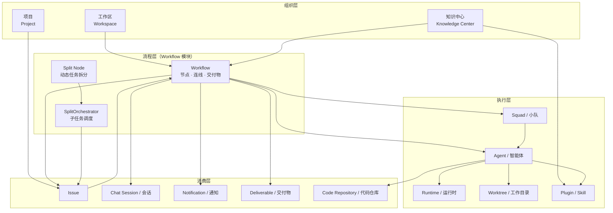
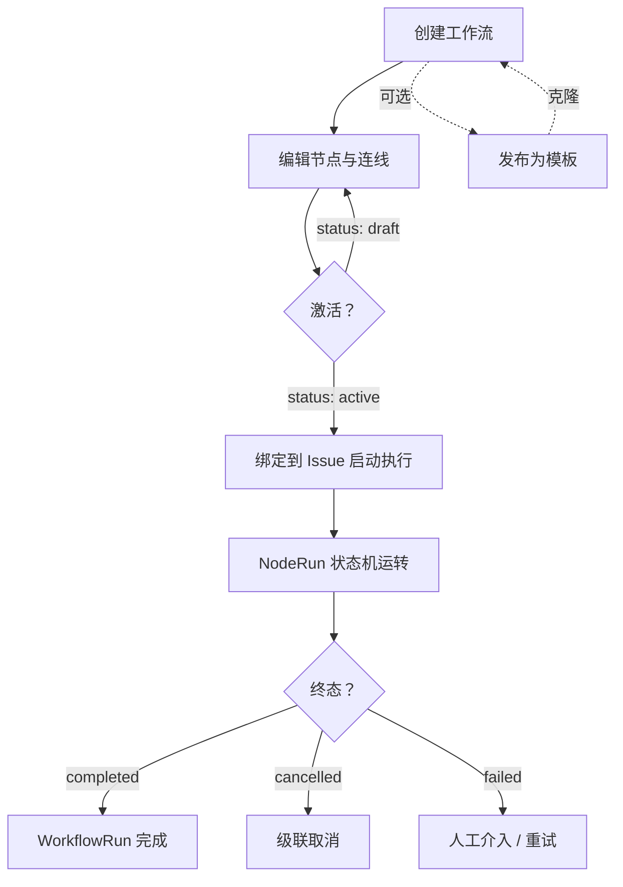
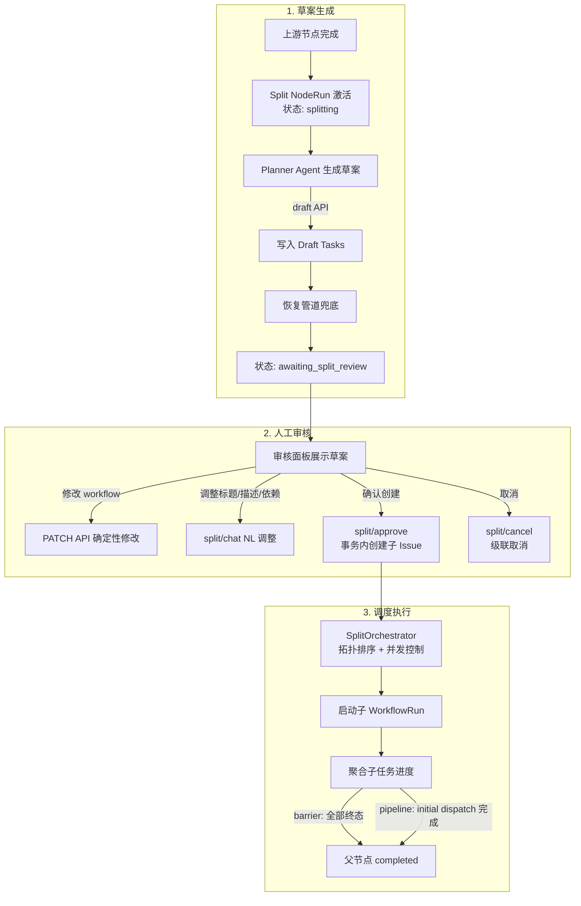
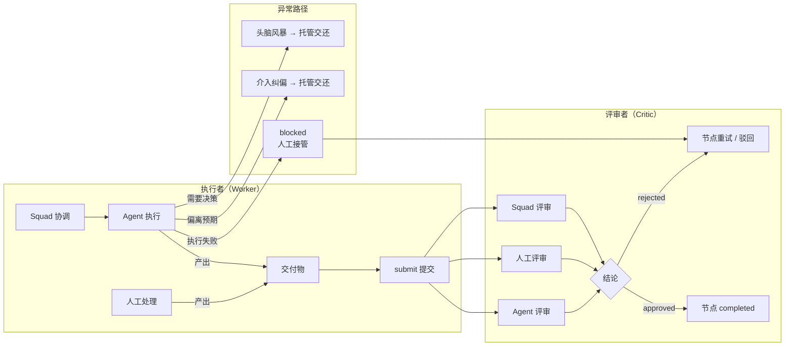
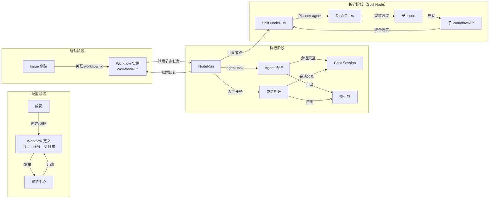
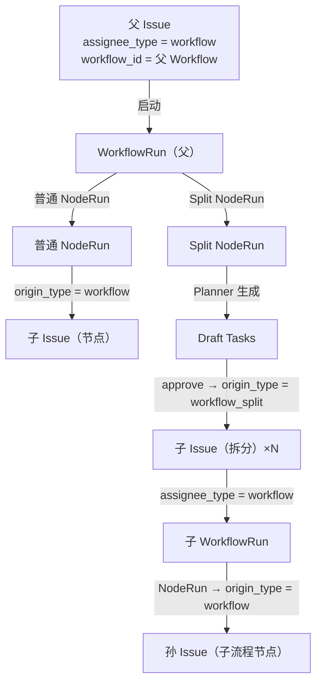
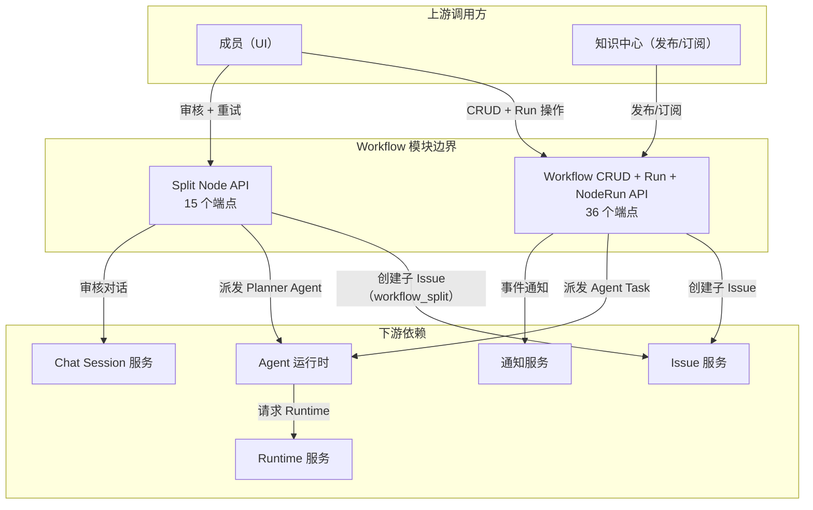

# Workflow 模块上下游关系与 API 关联分析

> 基于以下文档及代码实现梳理：
> - `docs/workflows/企业编程协作平台-用户旅程.md`
> - `docs/superpowers/specs/dynamic-task-splitting-design.md`
> - `server/cmd/server/router.go` / `server/internal/handler/workflow.go`
> - `packages/core/api/client.ts`
>
> 仅关注 Workflow 模块与外部模块之间的关系，不展开内部实现细节。

---

## 1. Workflow 在整体系统中的定位

Workflow 是 Multica 平台的**研发流程编排引擎**，位于业务层核心。它上承工作区（Workspace）与项目（Project）的组织结构，下接 Agent、Squad、Runtime 等执行基础设施，将研发协作流程抽象为可配置、可复用、可观测的有向无环图（DAG）。

---

## 2. 业务流程

### 2.1 Workflow 全生命周期

**关键状态**：
- Workflow: `draft` → `active`（激活时校验所有节点 Worker/Critic 已配置）
- WorkflowRun: 由 NodeRun 聚合驱动
- NodeRun: `pending` → `in_progress` → `awaiting_review` → `completed` / `blocked` / `failed`

### 2.2 Split Node 拆分协作流程

### 2.3 Node Run 执行者/评审者交互流程

---

## 3. 上游调用方 / 数据来源

| 上游模块 | 关系说明 |
|---------|---------|
| **工作区（Workspace）** | Workflow 归属工作区，生命周期受工作区约束。工作区不可用时 Workflow 不可操作 |
| **知识中心（Knowledge Center）** | TL 可将 Workflow 发布至知识中心供团队订阅复用；成员可从知识中心订阅并启用 Workflow。发布内容含节点连线信息与智能体集合 |
| **项目（Project）** | Issue 关联 Workflow 时必须关联项目 |
| **成员（Member）** | 成员创建、编辑、删除、启用、停用 Workflow；在审核期确认草案 |
| **管理员（Admin）** | 审核 Workflow 发布至知识中心的申请 |
| **组织关系（CoStrict）** | 研发角色动态映射关联研发岗位，用于节点执行者/评审者配置 |

---

## 4. 下游依赖 / 消费方

| 下游模块 | 关系说明 |
|---------|---------|
| **Issue** | Workflow 被 Issue 关联后启动执行；Workflow 执行过程中创建节点子 Issue（`origin_type = "workflow"`）；Split Node 创建子 Issue（`origin_type = "workflow_split"`）。删除/停用 Workflow 时提示关联 Issue 影响 |
| **Agent / 智能体** | Workflow 节点可配置 Agent 作为执行者或评审者。Agent 按节点上下文、交付物要求、插件能力执行任务。Split Node 的 Planner Agent 负责生成草案 |
| **Squad / 小队** | Workflow 节点可配置 Squad 作为执行者或评审者，由 Leader Agent 负责小队内任务分配 |
| **Runtime / 运行时** | Agent 执行需要指定运行时（Issue 粒度）。支持指定运行时和动态运行时策略；不可用时支持路由至其他运行时 |
| **Worktree** | Agent 执行任务时基于 Worktree 创建工作目录 |
| **Plugin / Skill** | Agent 执行时从知识中心下载 Plugin/Skill，作用范围限当前工作目录。智能体创建时可选择关联 Plugin/Skill |
| **Chat Session / 会话** | 人工介入 Agent 执行、头脑风暴、纠偏均通过会话空间完成。Split Node 审核期支持 `/split/chat` NL 调整草案 |
| **Notification / 通知** | 任务失败、头脑风暴、任务分配等场景通过邮箱、企微、CSC 状态栏通知用户 |
| **Deliverable / 交付物** | 节点定义交付物（文档/PR）及交付要求；执行者完成任务后提交交付物。评审者检视交付物并给出评审结论 |
| **Code Repository / 代码仓库** | 编码阶段关联代码仓库，完成开发后提交 PR 作为交付物上传。所有编码节点完成后由 Agent 汇总代码变更并整合 |
| **SplitOrchestrator** | 管理 Split Node 的子任务调度：按拓扑顺序 + 并发上限启动子 WorkflowRun，聚合子任务进度 |

---

## 5. 模块间数据流转关系

### 5.1 核心数据流

### 5.2 Issue 与 Workflow 绑定及派生关系

**origin_type 区分规则**：

| origin_type | 来源 | 含义 |
|------------|------|------|
| `workflow` | 普通 NodeRun 或子 Workflow 内部节点 | 标准工作流派生子 Issue |
| `workflow_split` | Split Node approve 时创建 | 拆分任务派生子 Issue，仅由 SplitOrchestrator 启动 |

### 5.3 数据关系汇总

| 数据实体 | 关联实体 | 关联方式 |
|---------|---------|---------|
| Workflow（MulticaWorkflow） | Workspace | `workspace_id` 列（`WorkspaceID pgtype.UUID`） |
| Workflow | Issue | Issue 的 `workflow_id` / `assignee_type = "workflow"` |
| WorkflowRun（MulticaWorkflowRun） | Workflow | `workflow_id` 列（`WorkflowID pgtype.UUID`） |
| WorkflowNodeRun（MulticaWorkflowNodeRun） | WorkflowRun | `workflow_run_id` 列（`WorkflowRunID pgtype.UUID`） |
| SplitTask（MulticaWorkflowSplitTask） | WorkflowNodeRun | `node_run_id` 列（`NodeRunID pgtype.UUID`） |
| SplitTask（MulticaWorkflowSplitTask） | Issue（子） | `issue_id` 列，`origin_type = "workflow_split"` |
| SplitTask（MulticaWorkflowSplitTask） | WorkflowRun（子） | `run_id` 列 |
| SplitTask（MulticaWorkflowSplitTask） | Workflow（子执行） | `workflow_id` 列，指向子 issue 的执行 workflow |
| WorkflowNodeRun（MulticaWorkflowNodeRun） | ChatSession（审核） | `split_review_chat_session_id` 列（`SplitReviewChatSessionID pgtype.UUID`） |
| Agent | Plugin/Skill | 知识中心关联 |
| Agent | Runtime | 执行时指定 |

---

## 6. API 调用关系与接口边界

> 以下 API 端点及字段来自 `server/cmd/server/router.go`、`server/internal/handler/workflow.go` 和 `packages/core/api/client.ts` 的代码实现。标注"代码中不存在"表示该业务操作在当前代码库中尚未实现。

### 6.1 Workflow CRUD

| 方法 | 端点 | 说明 | 请求字段 | 响应字段 |
|------|------|------|---------|---------|
| `GET` | `/api/workflows` | 列出 Workflow（支持 `?template=true/false` 筛选） | Query: `workspace_id`, `template?` | `{ workflows: WorkflowResponse[] }` |
| `POST` | `/api/workflows` | 创建 Workflow（支持 `template_id` 从模板克隆） | `title`, `description?`, `template_id?` | `WorkflowResponse` |
| `GET` | `/api/workflows/{id}` | 获取 Workflow 详情（含 nodes, edges, stages） | — | `{ workflow, nodes, edges, stages }` |
| `PUT` | `/api/workflows/{id}` | 更新 Workflow（含 status 变更） | `title?`, `description?`, `status?`, `max_retries?` | `WorkflowResponse` |
| `DELETE` | `/api/workflows/{id}` | 删除 Workflow（模板有派生 workflow 时返回 409） | — | `{ deleted: id }` |
| `PUT` | `/api/workflows/{id}/template` | 切换模板标记（需 `can_manage_workflows` 权限） | `is_template: boolean` | `WorkflowResponse` |

**WorkflowResponse 字段**：

`id`, `workspace_id`, `title`, `description`, `status`（draft/active）, `max_retries`, `created_by_type`, `created_by_id`, `node_count`, `is_template`, `source_template_id`, `created_at`, `updated_at`

### 6.2 Node CRUD

| 方法 | 端点 | 说明 | 请求字段 | 响应字段 |
|------|------|------|---------|---------|
| `GET` | `/api/workflows/{id}/nodes` | 列出节点 | — | `{ nodes: WorkflowNodeResponse[] }` |
| `POST` | `/api/workflows/{id}/nodes` | 创建节点 | `title`, `description?`, `position_x`, `position_y`, `format_schema?`, `worker_type?`(默认 agent), `worker_id?`, `critic_type?`(默认 human), `critic_id?`, `critic_api_url?`, `stage_id?` | `WorkflowNodeResponse` |
| `PUT` | `/api/workflows/{id}/nodes/{nodeId}` | 更新节点 | `title?`, `description?`, `position_x?`, `position_y?`, `format_schema?`, `worker_type?`, `worker_id?`, `critic_type?`, `critic_id?`, `critic_api_url?`, `sort_order?` | `WorkflowNodeResponse` |
| `DELETE` | `/api/workflows/{id}/nodes/{nodeId}` | 删除节点 | — | `{ deleted: nodeId }` |

**WorkflowNodeResponse 字段**：

`id`, `workflow_id`, `title`, `description`, `position_x`, `position_y`, `format_schema`, `worker_type`, `worker_id?`, `critic_type`, `critic_id?`, `critic_api_url?`, `sort_order`, `stage_id?`, `created_at`, `updated_at`

### 6.3 Edge CRUD

| 方法 | 端点 | 说明 | 请求字段 | 响应字段 |
|------|------|------|---------|---------|
| `GET` | `/api/workflows/{id}/edges` | 列出连线 | — | `{ edges: WorkflowEdgeResponse[] }` |
| `POST` | `/api/workflows/{id}/edges` | 创建连线 | `source_node_id`, `target_node_id`, `condition?` | `WorkflowEdgeResponse` |
| `DELETE` | `/api/workflows/{id}/edges/{edgeId}` | 删除连线 | — | `{ deleted: edgeId }` |

**WorkflowEdgeResponse 字段**：

`id`, `workflow_id`, `source_node_id`, `target_node_id`, `condition`, `created_at`

### 6.4 Stage CRUD

| 方法 | 端点 | 说明 | 请求字段 | 响应字段 |
|------|------|------|---------|---------|
| `GET` | `/api/workflows/{id}/stages` | 列出阶段 | — | `{ stages: WorkflowStageResponse[] }` |
| `POST` | `/api/workflows/{id}/stages` | 创建阶段 | `name`, `description?`, `sort_order?` | `WorkflowStageResponse` |
| `PUT` | `/api/workflows/{id}/stages/{stageId}` | 更新阶段 | `name?`, `description?`, `sort_order?` | `WorkflowStageResponse` |
| `DELETE` | `/api/workflows/{id}/stages/{stageId}` | 删除阶段（自动压缩 sort_order） | — | `{ status: "deleted" }` |
| `PUT` | `/api/workflows/{id}/stages/reorder` | 批量重排阶段顺序 | `[{ id, sort_order }]` | `{ status: "reordered" }` |
| `PUT` | `/api/workflows/{id}/nodes/{nodeId}/stage` | 分配节点到阶段（传 null 则取消分配） | `stage_id: string \| null` | `WorkflowNodeResponse` |

**WorkflowStageResponse 字段**：

`id`, `workflow_id`, `name`, `description`, `sort_order`, `node_count`, `created_at`, `updated_at`

### 6.5 Run（执行实例）API

| 方法 | 端点 | 说明 | 请求字段 | 响应字段 |
|------|------|------|---------|---------|
| `GET` | `/api/workflows/{id}/runs` | 列出运行记录 | — | `{ runs: WorkflowRun[] }` |
| `POST` | `/api/workflows/{id}/runs` | 启动 Workflow 执行 | `input?` | `WorkflowRun` |
| `GET` | `/api/workflows/{id}/runs/{runId}` | 获取运行详情 | — | `WorkflowRun` |
| `POST` | `/api/workflows/{id}/runs/{runId}/cancel` | 取消运行 | — | `WorkflowRun` |
| `GET` | `/api/workflows/{id}/runs/{runId}/node-runs` | 列出节点运行记录 | — | `{ node_runs: WorkflowNodeRun[] }` |
| `GET` | `/api/workflows/{id}/runs/{runId}/canvas-summary` | 获取画布概览 | — | `WorkflowRunCanvasSummaryResponse` |

### 6.6 Node Run 操作 API

| 方法 | 端点 | 说明 | 请求字段 | 响应字段 |
|------|------|------|---------|---------|
| `POST` | `/api/node-runs/{nodeRunId}/submit` | 提交节点交付物 | `output` | `WorkflowNodeRun` |
| `POST` | `/api/node-runs/{nodeRunId}/review` | 评审节点（通过/驳回） | `approved: boolean`, `comment?` | `WorkflowNodeRun` |
| `POST` | `/api/node-runs/{nodeRunId}/skip` | 跳过节点 | — | `WorkflowNodeRun` |
| `POST` | `/api/node-runs/{nodeRunId}/retry` | 重试节点 | — | `WorkflowNodeRun` |
| `POST` | `/api/node-runs/{nodeRunId}/blocked` | 人工接管：暂停 Agent，介入其 CSC 会话（working → blocked，completed_at 留 NULL） | — | `WorkflowNodeRun` |
| `POST` | `/api/node-runs/{nodeRunId}/working` | 交还 Agent：恢复同一 CSC 会话继续执行（blocked → working，重 dispatch worker task） | — | `WorkflowNodeRun` |
| `POST` | `/api/node-runs/{nodeRunId}/finalize` | 最终确认：人类直接裁决节点通过/失败（blocked → completed/failed），触发下游传播 | `approved: boolean` | `WorkflowNodeRun` |

### 6.7 辅助 API

| 方法 | 端点 | 说明 | 请求字段 | 响应字段 |
|------|------|------|---------|---------|
| `GET` | `/api/my-tasks` | 列出当前用户的 Workflow 任务 | Query: `workspace_id` | `{ node_runs: WorkflowNodeRun[] }` |
| `GET` | `/api/workflow-roles` | 列出 Workflow 角色 | — | `{ roles: WorkflowRoleResponse[] }` |
| `POST` | `/api/workflow-roles` | 创建 Workflow 角色 | `name`, `description?` | `WorkflowRoleResponse` |
| `GET` | `/api/sessions/{sessionId}/permission` | 校验会话访问权限 | — | `SessionPermissionResponse` |
| `GET` | `/api/workflow-admins` | 列出 Workflow 管理员 | — | `{ admins: WorkflowAdminResponse[] }` |
| `PUT` | `/api/workflow-admins` | 设置 Workflow 管理员列表 | `user_ids: string[]` | `{ admins: WorkflowAdminResponse[] }` |
| `POST` | `/api/workflow-admins/invite` | 通过 email 邀请 Workflow 管理员 | `email: string` | `WorkflowAdminResponse` |

### 6.8 代码中不存在的业务操作

以下操作在用户旅程文档中描述，但当前代码库中未找到对应 API 端点：

| 业务操作 | 状态 | 说明 |
|---------|------|------|
| 发布 Workflow 至知识中心 | 代码中不存在 | 用户旅程 §6 描述的功能，当前无对应 API |
| 从知识中心订阅并启用 Workflow | 代码中不存在 | 用户旅程 §7 描述的功能，当前无对应 API |
| 停用 Workflow | 代码中不存在 | 通过 `PUT /api/workflows/{id}` 的 `status` 字段（draft/active）间接管理，无独立停用端点 |

### 6.9 Split Node 专用 API

#### 6.9.1 草案生成与读取

| 方法 | 端点 | 说明 | 关键约束 |
|------|------|------|---------|
| `POST` | `/api/node-runs/{nodeRunID}/split/draft-tasks/batch` | Planner Agent 批量原子写入草案 | 需 `X-Task-ID` + `X-Agent-ID` header；Agent 传入的 `workflow_id` 被忽略；按 `(node_run_id, draft_key)` 幂等 upsert |
| `GET` | `/api/node-runs/{nodeRunID}/split/tasks` | 读取当前 split node run 下所有草案及聚合进度 | 响应含 `tasks` 数组和 `progress` 对象 |

**Draft API 安全契约**：

| 约束项 | 规则 |
|--------|------|
| 请求 Header | 必须携带 `X-Task-ID` 和 `X-Agent-ID` |
| Task 校验 | `X-Task-ID` 必须指向当前 `node_run_id` 绑定的 active split task，phase 须为 `split_generate` / `split_repair` / `split_chat` |
| Agent 校验 | `X-Agent-ID` 必须等于该 task 的 `agent_id` |
| 状态约束 | `split_generate` / `split_repair` 仅允许 `splitting` 状态；`split_chat` 仅允许 `awaiting_split_review` 状态 |
| 写入方式 | upsert 须使用非空 `draft_key`，按 `(node_run_id, draft_key)` 幂等更新 |
| 删除方式 | 只能标记 `discarded`，不能物理删除 |

#### 6.9.2 审核期确定性修改

| 方法 | 端点 | 说明 | 关键约束 |
|------|------|------|---------|
| `PATCH` | `/api/node-runs/{nodeRunID}/split/draft-tasks/{taskID}` | 修改单条草案 | 需 `expected_version`；冲突返回 `409 draft_task_conflict` |
| `PATCH` | `/api/node-runs/{nodeRunID}/split/draft-tasks/batch` | 批量修改草案 | 同上 |
| `POST` | `/api/node-runs/{nodeRunID}/split/draft-tasks` | 手动新增草案 | 同上 |
| `PATCH` | `/api/node-runs/{nodeRunID}/split/config` | 修改并发参数（`max_concurrency`） | 需 `expected_config_version`；冲突返回 `409 split_config_conflict`；仅 `awaiting_split_review` 和 `split_active` 状态可修改 |
| `DELETE` | `/api/node-runs/{nodeRunID}/split/draft-tasks/{taskID}` | 丢弃草案（标记 discarded） | 文档未提供详细约束 |

#### 6.9.3 审核与调度

| 方法 | 端点 | 说明 | 关键约束 |
|------|------|------|---------|
| `POST` | `/api/node-runs/{nodeRunID}/split/draft-submit` | 提交草案进入审核 | 文档未提供详细请求/响应字段 |
| `POST` | `/api/node-runs/{nodeRunID}/split/chat` | NL 指令调整草案（仅限非 workflow 字段） | 只能修改 title、description、depends_on、sort_order、discarded |
| `POST` | `/api/node-runs/{nodeRunID}/split/approve` | 审核确认，事务内创建子 Issue | 请求体：`{ approved_task_ids, confirm_empty }`；单次上限 50 条 |
| `POST` | `/api/node-runs/{nodeRunID}/split/cancel` | 取消拆分，级联停止子任务 | 前端须二次确认 |
| `POST` | `/api/node-runs/{nodeRunID}/split/reset-original` | 恢复至最初生成的草案 | 文档未提供详细请求/响应字段 |

#### 6.9.4 重试与恢复

| 方法 | 端点 | 说明 | 关键约束 |
|------|------|------|---------|
| `POST` | `/api/node-runs/{nodeRunID}/split/tasks/{taskID}/retry` | 重试单个失败子任务 | 可选传入新 `workflow_id` |
| `POST` | `/api/node-runs/{nodeRunID}/split/generate` | 手动触发重新生成拆分方案 | Agent 生成失败后使用 |
| `POST` | `/api/node-runs/{nodeRunID}/split/recover` | 手动触发恢复管道 | 从 Agent 输出、评论、附件中提取草案 |

#### 6.9.5 查询

| 方法 | 端点 | 说明 | 关键约束 |
|------|------|------|---------|
| `GET` | `/api/workflows/{id}/split/issue-workflow-options` | 获取可选子 Issue Workflow 列表 | `{id}` = parent workflow id；返回同 workspace 下 active、非当前 workflow、不含 split 节点的 workflow |

### 6.10 接口边界总结

### 6.11 错误响应码（Split API）

| HTTP 状态码 | 错误标识 | 触发条件 |
|------------|---------|---------|
| `409` | `draft_task_conflict` | 版本冲突（`expected_version` 不匹配） |
| `409` | `split_config_conflict` | Config 版本冲突（`expected_config_version` 不匹配） |
| `422` | `invalid_split_task_workflow` | Workflow 校验失败（不存在、非 active、含 split 节点、指向自身） |
| `422` | `invalid_split_task_dependency` | 依赖 DAG 校验失败（引用 discarded task、无无依赖 ready task） |
| `422` | `split_task_limit_exceeded` | 单次 approve 超过 50 条上限 |
| `404` | （文档未提供具体标识） | workspace 或父 issue 不可用 |

---

## 7. 关键边界约束

| 约束 | 说明 |
|------|------|
| 工作区隔离 | 所有 Workflow 操作限定在工作区范围内，`workspace_id` 贯穿所有数据实体 |
| 激活校验 | Workflow 从 draft 切换为 active 时，校验所有节点 Worker/Critic 已配置 |
| 拆分嵌套限制 | 第一期不支持三层及以上拆分嵌套；子 Issue 的 workflow 不能包含 split 节点 |
| 子 Issue 启动控制 | `workflow_split` 子 Issue 只由 SplitOrchestrator 启动，普通 Issue 链路不得自动启动 |
| Issue 列表隐藏规则 | 需同时排除 `workflow` 和 `workflow_split` 两种 `origin_type` |
| 拆分阶段副作用控制 | 基于 `X-Task-ID` 识别拆分阶段请求，禁止 Issue 状态变更和创建 |
| 审核期 Workflow 修改隔离 | NL 只能调整非 workflow 字段，Workflow 修改必须走确定性 PATCH API |
| Pipeline 释放不可逆 | 父节点释放为 `completed` 后，后续子任务失败不回滚父节点终态 |
| 模板克隆约束 | 模板中所有 Worker/Critic Agent 必须为 built-in agent，防止跨工作区克隆后 Agent 丢失 |
