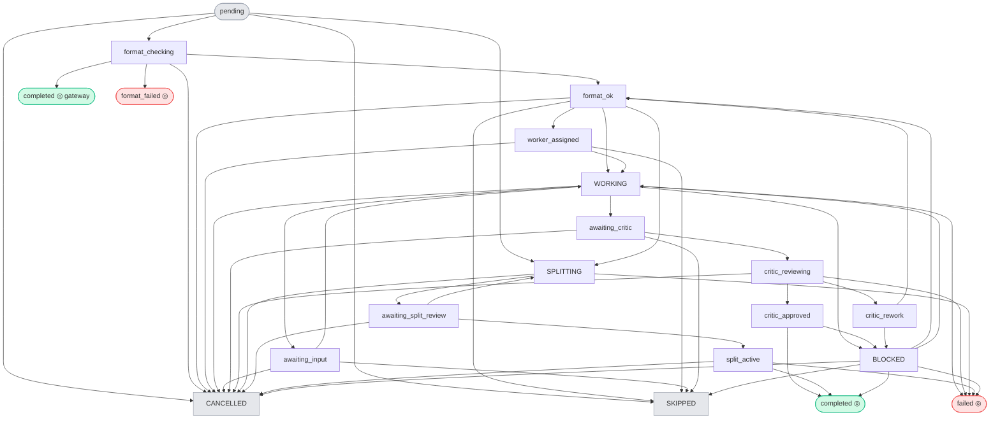
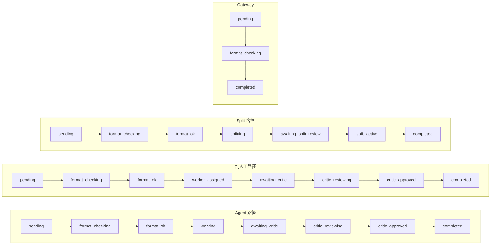
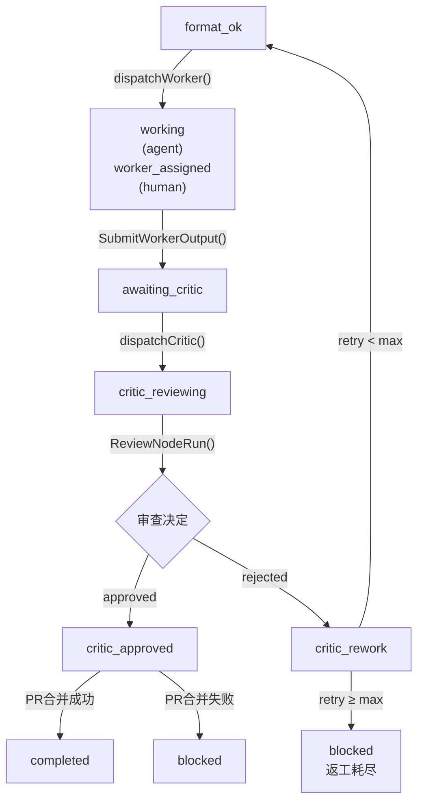
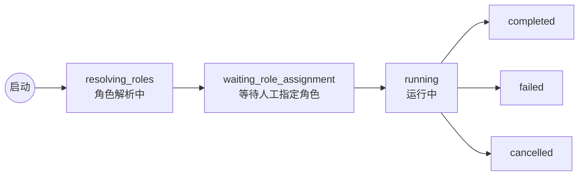

# Workflow 节点运行状态流转与前端显示

> 基于 `server/internal/service/workflow.go` 状态机和 `packages/core/types/workflow.ts` 前端映射。

---

## 一、三层状态体系

```
后端精确状态 (19)  ──映射──►  前端显示状态 (8)  ──渲染──►  视觉呈现 (图标+颜色+光环)
```

| 层次 | 类型 | 数量 | 定义位置 |
|------|------|------|---------|
| 原始状态 | `NodeRunStatus` | 19 | `workflow.go:84-107` / `types/workflow.ts:205` |
| 运行级别 | `WorkflowRunStatus` | 6 | 同上 |
| 显示状态 | `WorkflowRuntimeDisplayStatus` | 8 | `types/workflow.ts:218` |

---

## 二、NodeRunStatus 状态机

### 2.1 状态总览



> ◎ = 终态。初态终态用 `◎` 标注，中间态无标注。

### 2.2 终态判断

`completed` `failed` `skipped` `format_failed` `cancelled` — 这 5 个状态无离开边（`blocked` 除外，支持人工接管恢复）。

Go 端定义：`workflow.go:152`
```go
func isTerminalNodeRunStatus(s string) bool {
    switch s {
    case "completed", "failed", "skipped", "format_failed", "cancelled":
        return true
    }
    return false
}
```

### 2.3 关键路径



**Human vs Agent 核心差异**：`dispatchWorker()` 中 human → `worker_assigned`（显示「待办」），agent → `working`（显示「进行中」）。人工节点没有自动执行过程，需要人主动提交输出后才进入 `awaiting_critic`。

### 2.4 Worker-Critic 循环



---

## 三、WorkflowRunStatus



`checkRunCompletion()` 在所有 node run 变为终态时自动判定：有 `failed`/`format_failed` → Run `failed`，全部 `completed`/`skipped` → Run `completed`。

---

## 四、显示状态映射

### 4.1 映射总表

| 原始状态 → | 显示状态 | 图标 | 颜色 |
|-----------|---------|------|------|
| `pending` | `pending` 待处理 | Circle | gray |
| `worker_assigned` | `todo` 待办 | Clock | amber |
| `format_checking` `format_ok` `awaiting_input` `working` `splitting` `split_active` | `in_progress` 进行中 | Loader2(旋转) | blue |
| `awaiting_critic` `critic_reviewing` `awaiting_split_review` | `reviewing` 审查中 | Clock/UserCheck | blue/amber |
| `critic_approved` `completed` | `completed` 已完成 | CheckCircle2 | green |
| `failed` | `failed` 失败 | AlertCircle | red |
| `format_failed` `blocked` `critic_rework` | `blocked` 已阻塞 | AlertCircle | red |
| `cancelled` `skipped` | `cancelled` 已取消 | MinusCircle | gray |

### 4.2 Go/TS 映射差异

| 映射方 | `failed` → | 说明 |
|--------|-----------|------|
| Go `workflowDisplayStatus` | `"blocked"` | 后端 API 返回值 |
| TS `toWorkflowRuntimeDisplayStatus` | `"failed"` | 前端逻辑 |
| **实际显示** (`RuntimeNodeCard:425`) | **`"failed"`** | 前端硬编码覆盖 |

```typescript
// runtime-node-card.tsx:425 — 前端强制覆盖
const displayStatus = nodeRun?.status === "failed"
    ? "failed"   // 无论后端返回什么
    : runtimeSummary?.display_status ?? ...
```

### 4.3 Gateway 特殊文本

| 条件 | 显示 |
|------|------|
| Fork + completed | "Dispatched" |
| Join + completed | "Joined" |
| Join + pending/todo | "Waiting for upstream" |

### 4.4 可操作状态

```typescript
// runtime-node-card.tsx:234
const ACTIONABLE_STATUSES = new Set([
  "awaiting_critic",   // → [Approve, Reject]
  "awaiting_input",    // → [Submit Input, Handback]
  "blocked",           // → [Retry, Skip, Complete]
  "failed",            // → [Retry, Skip, Complete]
  "format_failed",     // → [Retry, Skip, Complete]
  "critic_rework",     // → [Retry, Skip, Complete]
]);
```

### 4.5 卡片状态光环

| 显示状态 | 光晕颜色 |
|---------|---------|
| `failed` `blocked` | 红色 |
| `reviewing` | 紫色 |
| `completed` | 绿色 |
| `todo` | 琥珀色 |
| `in_progress` | 蓝色 |
| `pending` `cancelled` | 灰色 |

---

## 五、WebSocket 事件

| 事件 | 触发时机 |
|------|---------|
| `workflow:run_started` | Run 创建 |
| `workflow:run_completed` / `run_failed` / `run_cancelled` | Run 终态 |
| `workflow:node_run_started` | 节点开始执行 |
| `workflow:node_run_completed` | 节点完成/跳过 |
| `workflow:node_run_failed` / `node_run_blocked` / `node_run_reviewed` | 节点异常/阻塞/审查 |

---

## 六、关键文件

| 文件 | 内容 |
|------|------|
| `server/internal/service/workflow.go` | 状态常量、`validTransitions`、`TransitionNodeRun`、Worker-Critic 循环 |
| `server/internal/handler/workflow_run.go` | API 端点、`workflowDisplayStatus`、Canvas Summary |
| `packages/core/types/workflow.ts` | 全部状态类型定义、`toWorkflowRuntimeDisplayStatus` |
| `packages/views/issues/components/execution/node-run-status-icon.tsx` | 状态图标组件 |
| `packages/views/issues/components/execution/runtime-node-card.tsx` | 画布卡片、操作按钮、聚焦样式 |
| `packages/views/locales/zh-Hans/workflows.json` | 中文翻译 |
